# OpenSearch Dashboards

* [OpenSearch Dashboards](#Dashboards)
    - [Discover](#Discover)
        + [Screenshots](#DiscoverGallery)
    - [Visualizations and dashboards](#DashboardsVisualizations)
        + [Prebuilt visualizations and dashboards](#PrebuiltVisualizations)
            * [Screenshots](#PrebuiltVisualizationsGallery)
        + [Building your own visualizations and dashboards](#BuildDashboard)
            * [Screenshots](#NewVisualizationsGallery)

While Arkime provides very nice visualizations, especially for network traffic, [OpenSearch Dashboards](https://opensearch.org/docs/latest/dashboards/index/) (an open source general-purpose data visualization tool for OpenSearch) can be used to create custom visualizations (tables, charts, graphs, dashboards, etc.) using the same data.

The OpenSearch Dashboards container can be accessed at **https://localhost/dashboards/** if connecting locally. Several preconfigured dashboards for Zeek logs are included in Malcolm's OpenSearch Dashboards configuration.

OpenSearch Dashboards has several components for data searching and visualization:

## Discover

The **Discover** view enables you to view events on a record-by-record basis (similar to a *session* record in Arkime or an individual line from a Zeek log). See the official [Kibana User Guide](https://www.elastic.co/guide/en/kibana/7.10/index.html) (OpenSearch Dashboards is an open-source fork of Kibana, which is no longer open-source software) for information on using the Discover view:

* [Discover](https://www.elastic.co/guide/en/kibana/7.10/discover.html)
* [Searching Your Data](https://www.elastic.co/guide/en/kibana/7.10/search.html)

### Screenshots

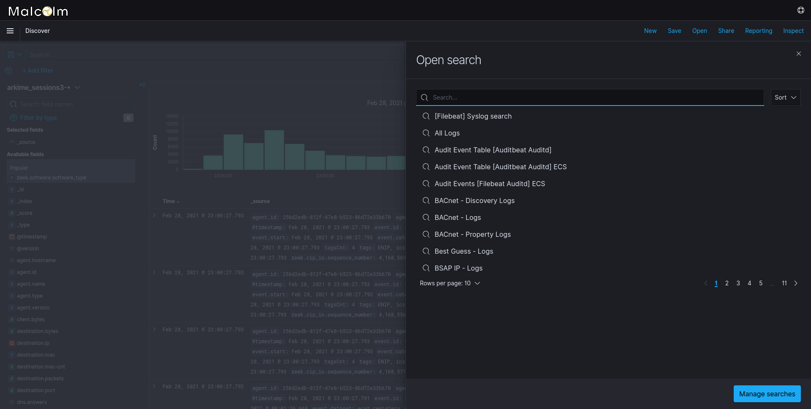

## Visualizations and dashboards

### Prebuilt visualizations and dashboards

Malcolm comes with dozens of prebuilt visualizations and dashboards for the network traffic represented by each of the Zeek log types. Click **Dashboard** to see a list of these dashboards. As is the case with all OpenSearch Dashboards visualizations, all of the charts, graphs, maps, and tables are interactive and can be clicked on to narrow or expand the scope of the data you are investigating. Similarly, click **Visualize** to explore the prebuilt visualizations used to build the dashboards.

Inspiration for many of Malcolm's prebuilt visualizations for Zeek logs was originally drawn from [Security Onion](https://github.com/Security-Onion-Solutions/securityonion)'s excellent Kibana dashboards.

#### Screenshots

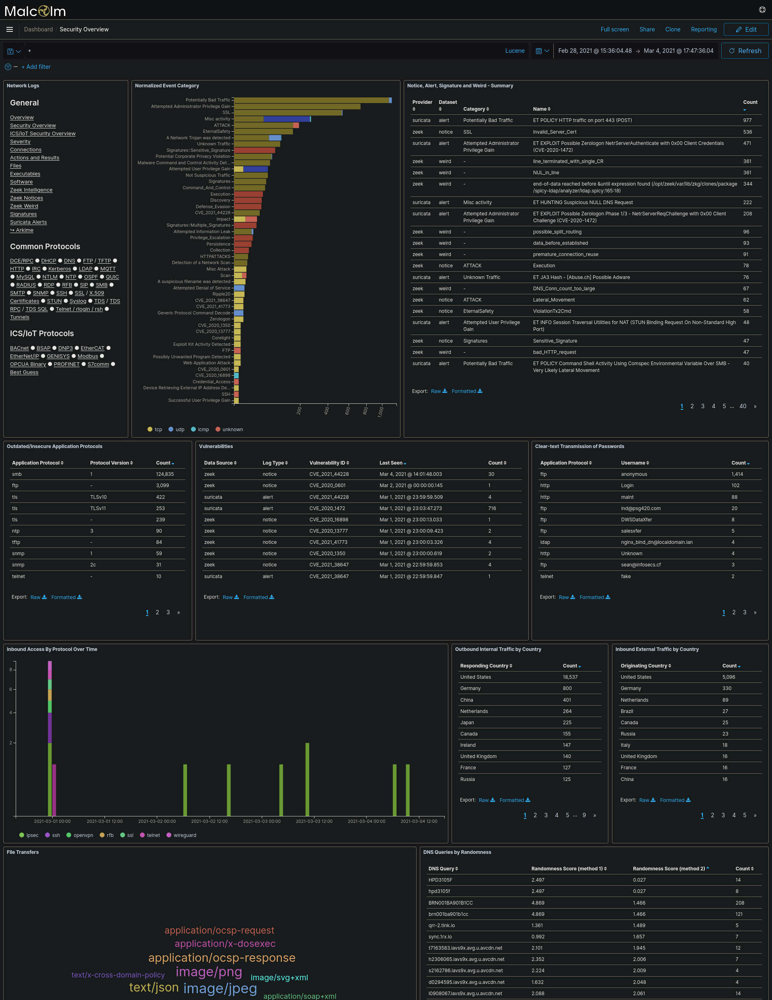

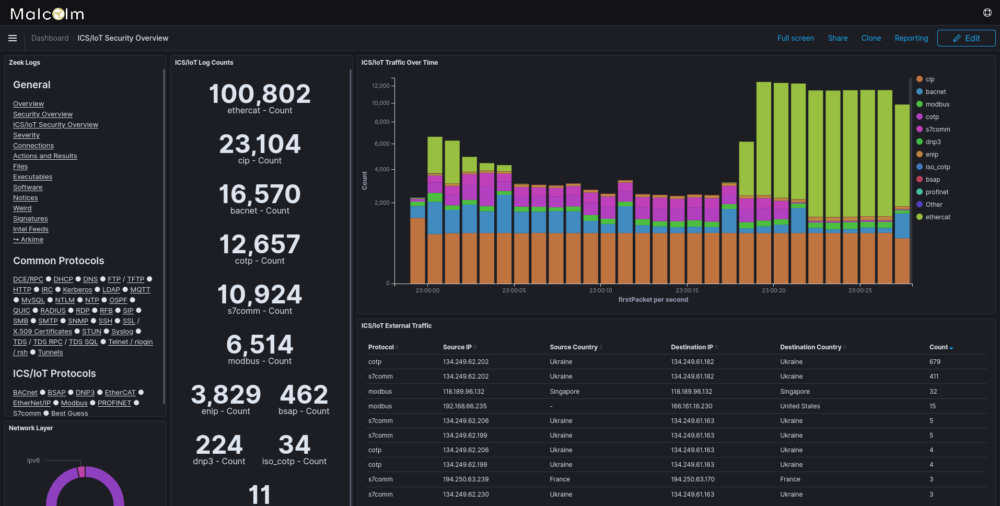

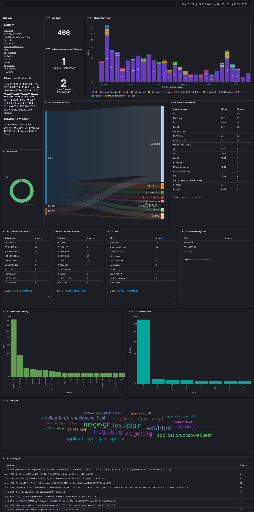

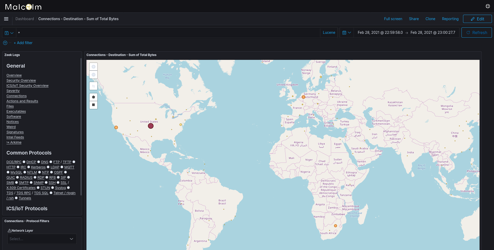

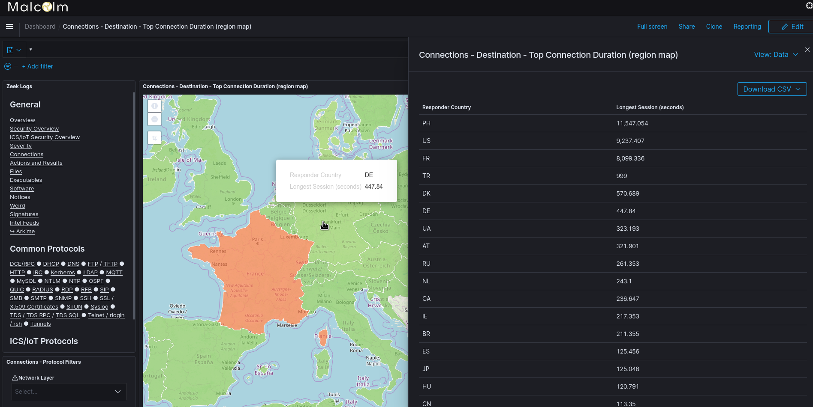

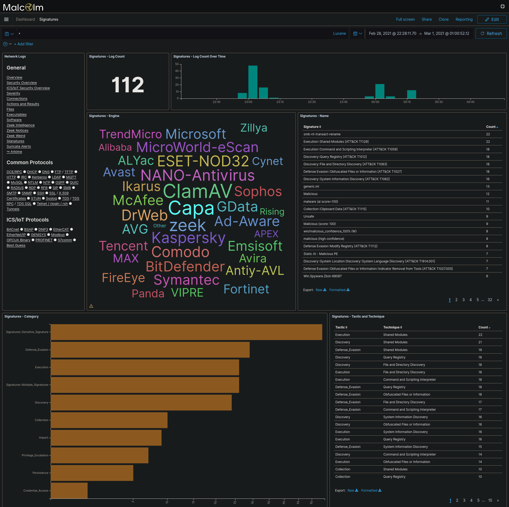

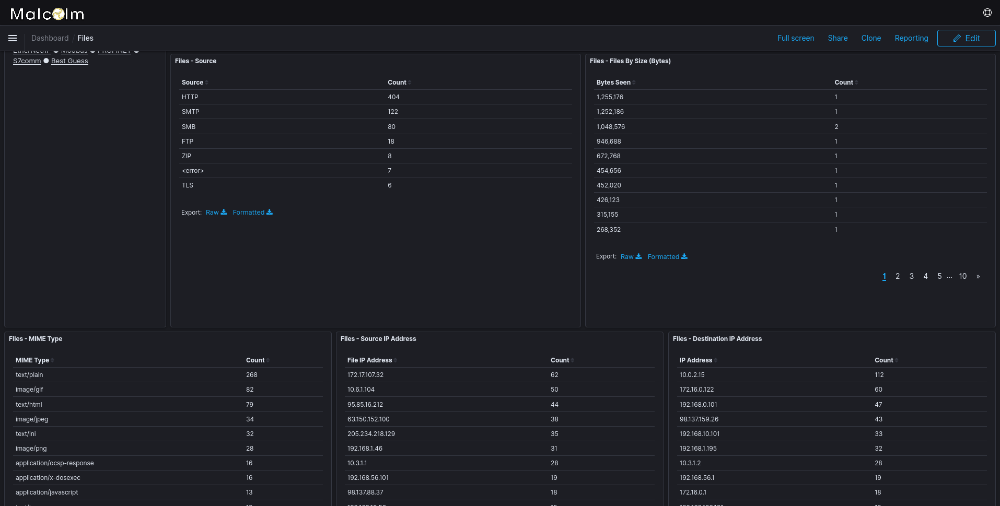

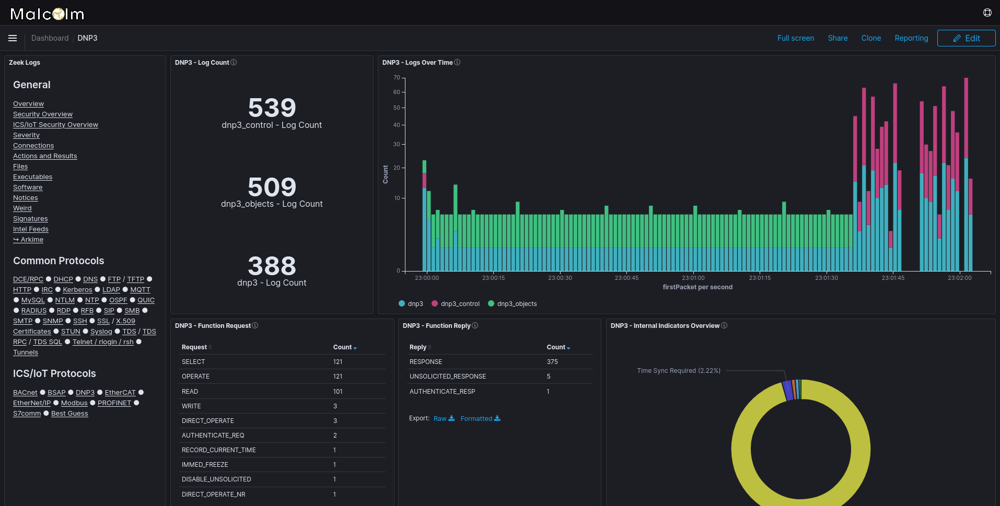

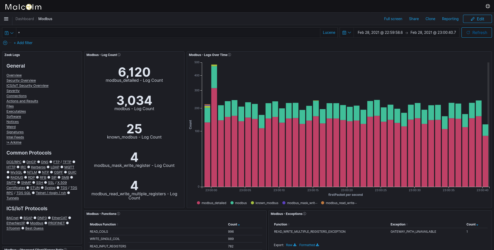

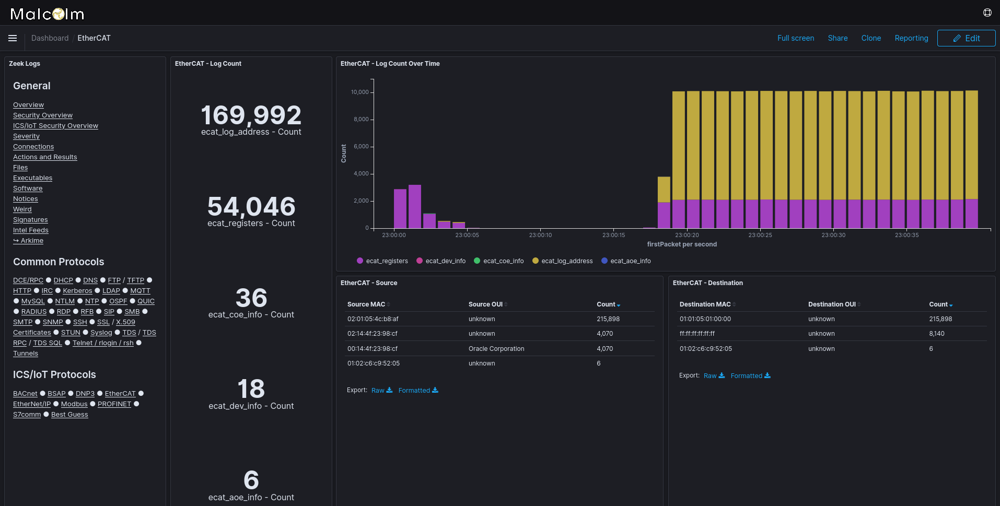

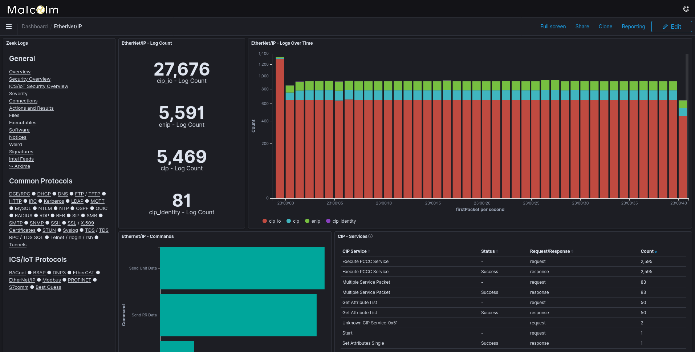

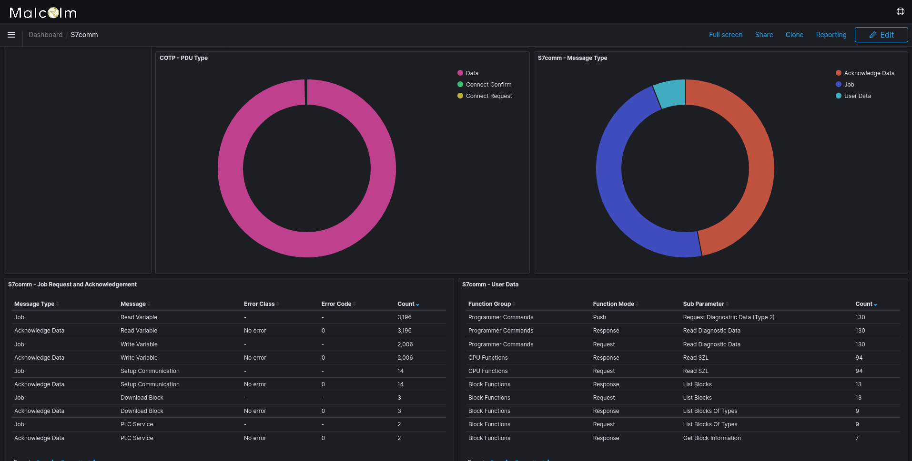

### Building your own visualizations and dashboards

See the official [Kibana User Guide](https://www.elastic.co/guide/en/kibana/7.10/index.html) and [OpenSearch Dashboards](https://opensearch.org/docs/latest/dashboards/index/) (OpenSearch Dashboards is an open-source fork of Kibana, which is no longer open-source software) documentation for information on creating your own visualizations and dashboards:

* [OpenSearch Dashboards](https://opensearch.org/docs/latest/dashboards/index/)
* [Kibana Dashboards](https://www.elastic.co/guide/en/kibana/7.10/dashboard.html)
* [TimeLine](https://www.elastic.co/guide/en/kibana/7.12/timelion.html)

#### Screenshots

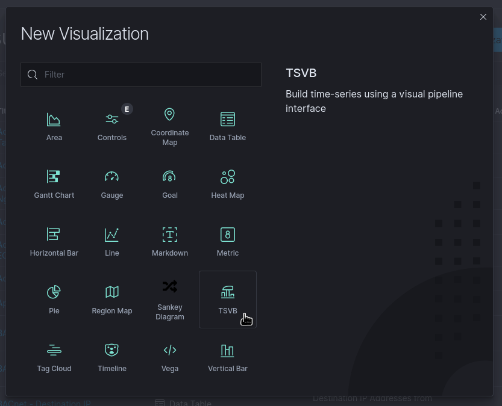