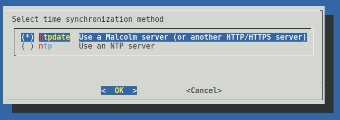

# Interfaces, hostname, and time synchronization

## Hostname

The first step of sensor configuration is to configure the network interfaces and sensor hostname. Clicking the **Configure Interfaces and Hostname** toolbar icon (or, if you are at a command line prompt, running `configure-interfaces`) will prompt you for the root password you created during installation, after which the configuration welcome screen is shown. Select **Continue** to proceed.

You may next select whether to configure the network interfaces, hostname, or time synchronization.

Selecting **Hostname**, you will be presented with a summary of the current sensor identification information, after which you may specify a new sensor hostname.  This name will be used to tag all events forwarded from this sensor in the events' **host.name** field.

## Interfaces

Returning to the configuration mode selection, choose **Interface**. You will be prompted if you would like help identifying network interfaces. If you select **Yes**, you will be prompted to select a network interface, after which that interface's link LED will blink for 10 seconds to help you in its identification. This network interface identification aid will continue to prompt you to identify further network interfaces until you select **No**.

You will be presented with a list of interfaces to configure as the sensor management interface. This is the interface the sensor itself will use to communicate with the network in order to, for example, forward captured logs to an aggregate server. In order to do so, the management interface must be assigned an IP address. This is generally **not** the interface used for capturing data. Select the interface to which you wish to assign an IP address. The interfaces are listed by name and MAC address and the associated link speed is also displayed if it can be determined. For interfaces without a connected network cable, generally a `-1` will be displayed instead of the interface speed.

Depending on the configuration of your network, you may now specify how the management interface will be assigned an IP address. In order to communicate with an event aggregator over the management interface, either **static** or **dhcp** must be selected.

If you select static, you will be prompted to enter the IP address, netmask, and gateway to assign to the management interface.

In either case, upon selecting **OK** the network interface will be brought down, configured, and brought back up, and the result of the operation will be displayed. You may choose **Quit** upon returning to the configuration tool's welcome screen.

## Time synchronization

Returning to the configuration mode selection, choose **Time Sync**. Here you can configure the sensor to keep its time synchronized with either an NTP server (using the NTP protocol) or a local [Malcolm](https://github.com/idaholab/Malcolm) aggregator or another HTTP/HTTPS server. On the next dialog, choose the time synchronization method you wish to configure.

If **htpdate** is selected, you will be prompted to enter the IP address or hostname and port of an HTTP/HTTPS server (for a Malcolm instance, port `9200` may be used) and the time synchronization check frequency in minutes. A test connection will be made to determine if the time can be retrieved from the server.

If *ntpdate* is selected, you will be prompted to enter the IP address or hostname of the NTP server.

Upon configuring time synchronization, a "Time synchronization configured successfully!" message will be displayed, after which you will be returned to the welcome screen.