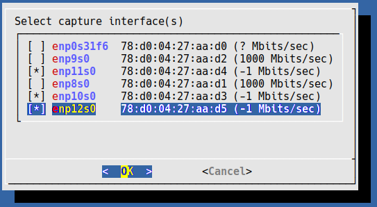
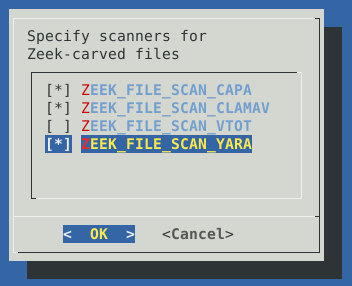
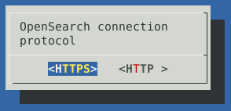
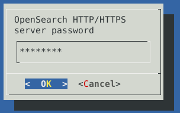
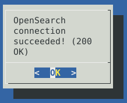
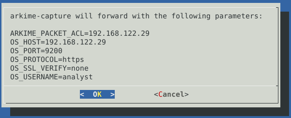
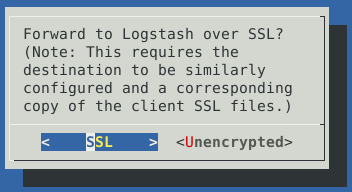
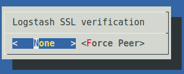
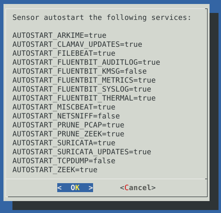

# <a name="HedgehogConfigUser"></a>Capture, forwarding, and autostart services

Clicking the **Configure Capture and Forwarding** toolbar icon (or, if you are at a command prompt, running `configure-capture`) will launch the configuration tool for capture and forwarding. The root password is not required as it was for the interface and hostname configuration, as sensor services are run under the non-privileged sensor account. Select **Continue** to proceed. You may select from a list of configuration options.


## <a name="HedgehogConfigCapture"></a>Capture

Choose **Configure Capture** to configure parameters related to traffic capture and local analysis. You will be prompted if you would like help identifying network interfaces. If you select **Yes**, you will be prompted to select a network interface, after which that interface's link LED will blink for 10 seconds to help you in its identification. This network interface identification aid will continue to prompt you to identify further network interfaces until you select **No**.

You will be presented with a list of network interfaces and prompted to select one or more capture interfaces. An interface used to capture traffic is generally a different interface than the one selected previously as the management interface, and each capture interface should be connected to a network tap or span port for traffic monitoring. Capture interfaces are usually not assigned an IP address as they are only used to passively “listen” to the traffic on the wire. The interfaces are listed by name and MAC address and the associated link speed is also displayed if it can be determined. For interfaces without a connected network cable, generally a `-1` will be displayed instead of the interface speed.



Upon choosing the capture interfaces and selecting OK, you may optionally provide a capture filter. This filter will be used to limit what traffic the PCAP service ([`tcpdump`](https://www.tcpdump.org/)) and the traffic analysis services ([`zeek`](https://www.zeek.org/) and [`suricata`](https://suricata.io/)) will see. Capture filters are specified using [Berkeley Packet Filter (BPF)](http://biot.com/capstats/bpf.html) syntax. Clicking **OK** will attempt to validate the capture filter, if specified, and will present a warning if the filter is invalid.


Next you must specify the paths where captured PCAP files and logs will be stored locally on the sensor. If the installation worked as expected, these paths should be prepopulated to reflect paths on the volumes formatted at install time for the purpose storing these artifacts. Usually these paths will exist on separate storage volumes. Enabling the PCAP and log pruning autostart services (see the section on autostart services below) will enable monitoring of these paths to ensure that their contents do not consume more than 90% of their respective volumes' space. Choose **OK** to continue.


### <a name="HedgehogZeekFileExtraction"></a>Automatic file extraction and scanning

Hedgehog Linux can leverage Zeek's knowledge of network protocols to automatically detect file transfers and extract those files from network traffic as Zeek sees them.

To specify which files should be extracted, specify the Zeek file carving mode:


If you're not sure what to choose, either of **mapped (except common plain text files)** (if you want to carve and scan almost all files) or **interesting** (if you only want to carve and scan files with [mime types of common attack vectors]({{ site.github.repository_url }}/blob/{{ site.github.build_revision }}/sensor-iso/interface/sensor_ctl/zeek/extractor_override.interesting.zeek)) is probably a good choice.

Next, specify which carved files to preserve (saved on the sensor under `/capture/bro/capture/extract_files/quarantine` by default). In order to not consume all of the sensor's available storage space, the oldest preserved files will be pruned along with the oldest Zeek logs as described below with **AUTOSTART_PRUNE_ZEEK** in the [autostart services](#HedgehogConfigAutostart) section.

You'll be prompted to specify which engine(s) to use to analyze extracted files. Extracted files can be examined through any of three methods:



* scanning files with [**ClamAV**](https://www.clamav.net/); to enable this method, select **ZEEK_FILE_SCAN_CLAMAV** when specifying scanners for Zeek-carved files
* submitting file hashes to [**VirusTotal**](https://www.virustotal.com/en/#search); to enable this method, select **ZEEK_FILE_SCAN_VTOT** when specifying scanners for Zeek-carved files, then manually edit `/opt/sensor/sensor_ctl/control_vars.conf` and specify your [VirusTotal API key](https://developers.virustotal.com/reference) in `VTOT_API2_KEY`
* scanning files with [**Yara**](https://github.com/VirusTotal/yara); to enable this method, select **ZEEK_FILE_SCAN_YARA** when specifying scanners for Zeek-carved files
* scanning portable executable (PE) files with [**Capa**](https://github.com/fireeye/capa); to enable this method, select **ZEEK_FILE_SCAN_CAPA** when specifying scanners for Zeek-carved files

Files which are flagged as potentially malicious will be logged as Zeek `signatures.log` entries, and can be viewed in the **Signatures** dashboard in [OpenSearch Dashboards]({{ site.github.repository_url }}#DashboardsVisualizations) when forwarded to Malcolm.


Finally, you will be presented with the list of configuration variables that will be used for capture, including the values which you have configured up to this point in this section. Upon choosing **OK** these values will be written back out to the sensor configuration file located at `/opt/sensor/sensor_ctl/control_vars.conf`. It is not recommended that you edit this file manually. After confirming these values, you will be presented with a confirmation that these settings have been written to the configuration file, and you will be returned to the welcome screen.

## <a name="HedgehogConfigForwarding"></a>Forwarding

Select **Configure Forwarding** to set up forwarding logs and statistics from the sensor to an aggregator server, such as [Malcolm]({{ site.github.repository_url }}).


There are three forwarder services used on the sensor, each for forwarding a different type of log or sensor metric.

## <a name="Hedgehogarkime-capture"></a>arkime-capture: Arkime session forwarding

arkime-[capture](https://github.com/arkime/arkime/tree/master/capture) is not only used to capture PCAP files, but also the parse raw traffic into sessions and forward this session metadata to an [OpenSearch](https://opensearch.org/) database so that it can be viewed in [Arkime viewer](https://arkime.com/), whether standalone or as part of a [Malcolm]({{ site.github.repository_url }}) instance. If you're using Hedgehog Linux with Malcolm, please read [Correlating Zeek logs and Arkime sessions]({{ site.github.repository_url }}#ZeekArkimeFlowCorrelation) in the Malcolm documentation for more information.

First, select the OpenSearch connection transport protocol, either **HTTPS** or **HTTP**. If the metrics are being forwarded to Malcolm, select **HTTPS** to encrypt messages from the sensor to the aggregator using TLS v1.2 using ECDHE-RSA-AES128-GCM-SHA256. If **HTTPS** is chosen, you must choose whether to enable SSL certificate verification. If you are using a self-signed certificate (such as the one automatically created during [Malcolm's configuration]({{ site.github.repository_url }}#configure-authentication)), choose **None**.

 

Next, enter the **OpenSearch host** IP address (ie., the IP address of the aggregator) and port. These metrics are written to an OpenSearch database using a RESTful API, usually using port 9200. Depending on your network configuration, you may need to open this port in your firewall to allow this connection from the sensor to the aggregator.


You will be asked to enter authentication credentials for the sensor's connections to the aggregator's OpenSearch API. After you've entered the username and the password, the sensor will attempt a test connection to OpenSearch using the connection information provided. If the Malcolm services have not yet been started, you may receive a **Connection refused** error. You may select **Ignore Error** for the credentials to be accepted anyway.

  

Finally, you will be shown a dialog for a list of IP addresses used to populate an access control list (ACL) for hosts allowed to connect back to the sensor for retrieving session payloads from its PCAP files for display in Arkime viewer. The list will be prepopulated with the IP address entered a few screens prior to this one.


Finally, you'll be given the opportunity to review the all of the Arkime `capture` options you've specified. Selecting **OK** will cause the parameters to be saved and you will be returned to the configuration tool's welcome screen.



## <a name="Hedgehogfilebeat"></a>filebeat: Zeek and Suricata log forwarding

[Filebeat](https://www.elastic.co/products/beats/filebeat) is used to forward [Zeek](https://www.zeek.org/) and [Suricata](https://suricata.io/) logs to a remote [Logstash](https://www.elastic.co/products/logstash) instance for further enrichment prior to insertion into an [OpenSearch](https://opensearch.org/) database.

To configure filebeat, first provide the log path (the same path previously configured for log file generation).


You must also provide the IP address of the Logstash instance to which the logs are to be forwarded, and the port on which Logstash is listening. These logs are forwarded using the Beats protocol, generally over port 5044. Depending on your network configuration, you may need to open this port in your firewall to allow this connection from the sensor to the aggregator.


Next you are asked whether the connection used for log forwarding should be done **unencrypted** or over **SSL**. Unencrypted communication requires less processing overhead and is simpler to configure, but the contents of the logs may be visible to anyone who is able to intercept that traffic.



If **SSL** is chosen, you must choose whether to enable [SSL certificate verification](https://www.elastic.co/guide/en/beats/filebeat/current/configuring-ssl-logstash.html). If you are using a self-signed certificate (such as the one automatically created during [Malcolm's configuration]({{ site.github.repository_url }}#configure-authentication), choose **None**.



The last step for SSL-encrypted log forwarding is to specify the SSL certificate authority, certificate, and key files. These files must match those used by the Logstash instance receiving the logs on the aggregator. If Malcolm's `auth_setup` script was used to generate these files they would be found in the `filebeat/certs/` subdirectory of the Malcolm installation and must be manually copied to the sensor (stored under `/opt/sensor/sensor_ctl/logstash-client-certificates` or in any other path accessible to the sensor account). Specify the location of the certificate authorities file (eg., `ca.crt`), the certificate file (eg., `client.crt`), and the key file (eg., `client.key`).


The Logstash instance receiving the events must be similarly configured with matching SSL certificate and key files. Under Malcolm, the `BEATS_SSL` variable must be set to `true` in Malcolm's `docker-compose.yml` file and the SSL files must exist in the `logstash/certs/` subdirectory of the Malcolm installation.

Once you have specified all of the filebeat parameters, you will be presented with a summary of the settings related to the forwarding of these logs. Selecting **OK** will cause the parameters to be written to filebeat's configuration keystore under `/opt/sensor/sensor_ctl/logstash-client-certificates` and you will be returned to the configuration tool's welcome screen.


## <a name="Hedgehogmiscbeat"></a>miscbeat: System metrics forwarding

The sensor uses [Fluent Bit](https://fluentbit.io/) to gather miscellaneous system resource metrics (CPU, network I/O, disk I/O, memory utilization, temperature, etc.) and the [Beats](https://www.elastic.co/guide/en/beats/filebeat/current/filebeat-input-tcp.html) protocol to forward these metrics to a remote [Logstash](https://www.elastic.co/products/logstash) instance for further enrichment prior to insertion into an [OpenSearch](https://opensearch.org/) database. Metrics categories can be enabled/disabled as described in the [autostart services](#HedgehogConfigAutostart) section of this document.

This forwarder's configuration is almost identical to that of [filebeat](#Hedgehogfilebeat) in the previous section. Select `miscbeat` from the forwarding configuration mode options and follow the same steps outlined above to set up this forwarder.

## <a name="HedgehogConfigAutostart"></a>Autostart services

Once the forwarders have been configured, the final step is to **Configure Autostart Services**. Choose this option from the configuration mode menu after the welcome screen of the sensor configuration tool.

Despite configuring capture and/or forwarder services as described in previous sections, only services enabled in the autostart configuration will run when the sensor starts up. The available autostart processes are as follows (recommended services are in **bold text**):

* **AUTOSTART_ARKIME** - [capture](#Hedgehogarkime-capture) PCAP engine for traffic capture, as well as traffic parsing and metadata insertion into OpenSearch for viewing in [Arkime](https://arkime.com/). If you are using Hedgehog Linux along with [Malcolm]({{ site.github.repository_url }}) or another Arkime installation, this is probably the packet capture engine you want to use.
* **AUTOSTART_CLAMAV_UPDATES** - Virus database update service for ClamAV (requires sensor to be connected to the internet)
* **AUTOSTART_FILEBEAT** - [filebeat](#Hedgehogfilebeat) Zeek and Suricata log forwarder 
* **AUTOSTART_FLUENTBIT_AIDE** - [Fluent Bit](https://fluentbit.io/) agent [monitoring](https://docs.fluentbit.io/manual/pipeline/inputs/exec) [AIDE](https://aide.github.io/) file system integrity checks
* **AUTOSTART_FLUENTBIT_AUDITLOG** - [Fluent Bit](https://fluentbit.io/) agent [monitoring](https://docs.fluentbit.io/manual/pipeline/inputs/tail) [auditd](https://man7.org/linux/man-pages/man8/auditd.8.html) logs
* *AUTOSTART_FLUENTBIT_KMSG* - [Fluent Bit](https://fluentbit.io/) agent [monitoring](https://docs.fluentbit.io/manual/pipeline/inputs/kernel-logs) the Linux kernel log buffer (these are generally reflected in syslog as well, which may make this agent redundant)
* **AUTOSTART_FLUENTBIT_METRICS** - [Fluent Bit](https://fluentbit.io/) agent for collecting [various](https://docs.fluentbit.io/manual/pipeline/inputs) system resource and performance metrics
* **AUTOSTART_FLUENTBIT_SYSLOG** - [Fluent Bit](https://fluentbit.io/) agent [monitoring](https://docs.fluentbit.io/manual/pipeline/inputs/syslog) Linux syslog messages
* **AUTOSTART_FLUENTBIT_THERMAL** - [Fluent Bit](https://fluentbit.io/) agent [monitoring](https://docs.fluentbit.io/manual/pipeline/inputs/thermal) system temperatures
* **AUTOSTART_MISCBEAT** - [filebeat](https://www.elastic.co/guide/en/beats/filebeat/current/filebeat-input-tcp.html) forwarder which sends system metrics collected by [Fluent Bit](https://fluentbit.io/) to a remote Logstash instance (e.g., [Malcolm]({{ site.github.repository_url }})'s)
* *AUTOSTART_NETSNIFF* - [netsniff-ng](http://netsniff-ng.org/) PCAP engine for saving packet capture (PCAP) files
* **AUTOSTART_PRUNE_PCAP** - storage space monitor to ensure that PCAP files do not consume more than 90% of the total size of the storage volume to which PCAP files are written
* **AUTOSTART_PRUNE_ZEEK** - storage space monitor to ensure that Zeek logs do not consume more than 90% of the total size of the storage volume to which Zeek logs are written
* **AUTOSTART_SURICATA** - [Suricata](https://suricata.io/) traffic analysis engine
* **AUTOSTART_SURICATA_UPDATES** - Rule update service for Suricata (requires sensor to be connected to the internet)
* *AUTOSTART_TCPDUMP* - [tcpdump](https://www.tcpdump.org/) PCAP engine for saving packet capture (PCAP) files
* **AUTOSTART_ZEEK** - [Zeek](https://www.zeek.org/) traffic analysis engine

Note that only one packet capture engine ([capture](https://arkime.com/), [netsniff-ng](http://netsniff-ng.org/), or [tcpdump](https://www.tcpdump.org/)) can be used.


Once you have selected the autostart services, you will be prompted to confirm your selections. Doing so will cause these values to be written back out to the `/opt/sensor/sensor_ctl/control_vars.conf` configuration file.



After you have completed configuring the sensor it is recommended that you reboot the sensor to ensure all new settings take effect. If rebooting is not an option, you may click the **Restart Sensor Services** menu icon in the top menu bar, or open a terminal and run:

```
/opt/sensor/sensor_ctl/shutdown && sleep 10 && /opt/sensor/sensor_ctl/supervisor.sh
```

This will cause the sensor services controller to stop, wait a few seconds, and restart. You can check the status of the sensor's processes by choosing **Sensor Status** from the sensor's kiosk mode, clicking the **Sensor Service Status** toolbar icon, or running `/opt/sensor/sensor_ctl/status` from the command line:

```
$ /opt/sensor/sensor_ctl/status 
arkime:arkime-capture            RUNNING   pid 6455, uptime 0:03:17
arkime:arkime-viewer             RUNNING   pid 6456, uptime 0:03:17
beats:filebeat                   RUNNING   pid 6457, uptime 0:03:17
beats:miscbeat                   RUNNING   pid 6458, uptime 0:03:17
clamav:clamav-service            RUNNING   pid 6459, uptime 0:03:17
clamav:clamav-updates            RUNNING   pid 6461, uptime 0:03:17
fluentbit-auditlog               RUNNING   pid 6463, uptime 0:03:17
fluentbit-kmsg                   STOPPED   Not started
fluentbit-metrics:cpu            RUNNING   pid 6466, uptime 0:03:17
fluentbit-metrics:df             RUNNING   pid 6471, uptime 0:03:17
fluentbit-metrics:disk           RUNNING   pid 6468, uptime 0:03:17
fluentbit-metrics:mem            RUNNING   pid 6472, uptime 0:03:17
fluentbit-metrics:mem_p          RUNNING   pid 6473, uptime 0:03:17
fluentbit-metrics:netif          RUNNING   pid 6474, uptime 0:03:17
fluentbit-syslog                 RUNNING   pid 6478, uptime 0:03:17
fluentbit-thermal                RUNNING   pid 6480, uptime 0:03:17
netsniff:netsniff-enp1s0         STOPPED   Not started
prune:prune-pcap                 RUNNING   pid 6484, uptime 0:03:17
prune:prune-zeek                 RUNNING   pid 6486, uptime 0:03:17
supercronic                      RUNNING   pid 6490, uptime 0:03:17
suricata                         RUNNING   pid 6501, uptime 0:03:17
tcpdump:tcpdump-enp1s0           STOPPED   Not started
zeek:capa                        RUNNING   pid 6553, uptime 0:03:17
zeek:clamav                      RUNNING   pid 6512, uptime 0:03:17
zeek:logger                      RUNNING   pid 6554, uptime 0:03:17
zeek:virustotal                  STOPPED   Not started
zeek:watcher                     RUNNING   pid 6510, uptime 0:03:17
zeek:yara                        RUNNING   pid 6548, uptime 0:03:17
zeek:zeekctl                     RUNNING   pid 6502, uptime 0:03:17
```