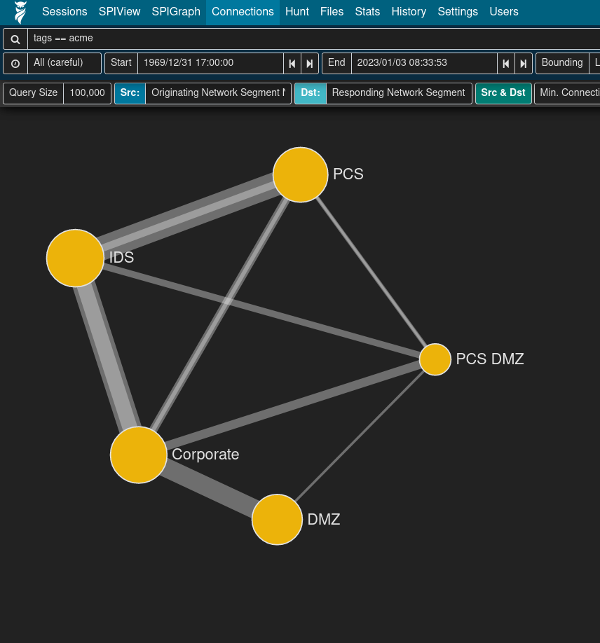

# <a name="HostAndSubnetNaming"></a>Automatic host and subnet name assignment

* [Automatic host and subnet name assignment](host-and-subnet-mapping.md#HostAndSubnetNaming)
    - [IP/MAC address to hostname mapping via `host-map.txt`](host-and-subnet-mapping.md#HostNaming)
    - [CIDR subnet to network segment name mapping via `cidr-map.txt`](host-and-subnet-mapping.md#SegmentNaming)
    - [Defining hostname and CIDR subnet names interface](host-and-subnet-mapping.md#NameMapUI)
    - [Applying mapping changes](host-and-subnet-mapping.md#ApplyMapping)

## <a name="HostNaming"></a>IP/MAC address to hostname mapping via `host-map.txt`

The `host-map.txt` file in the Malcolm installation directory can be used to define names for network hosts based on IP and/or MAC addresses in Zeek logs. The default empty configuration looks like this:
```
# IP or MAC address to host name map:
#   address|host name|required tag
#
# where:
#   address: comma-separated list of IPv4, IPv6, or MAC addresses
#          e.g., 172.16.10.41, 02:42:45:dc:a2:96, 2001:0db8:85a3:0000:0000:8a2e:0370:7334
#
#   host name: host name to be assigned when event address(es) match
#
#   required tag (optional): only check match and apply host name if the event
#                            contains this tag
#
```
Each non-comment line (not beginning with a `#`), defines an address-to-name mapping for a network host. For example:
```
127.0.0.1,127.0.1.1,::1|localhost|
192.168.10.10|office-laptop.intranet.lan|
06:46:0b:a6:16:bf|serial-host.intranet.lan|testbed
```
Each line consists of three `|`-separated fields: address(es), hostname, and, optionally, a tag which, if specified, must belong to a log for the matching to occur.

As Zeek logs are processed into Malcolm's OpenSearch instance, the log's source and destination IP and MAC address fields (`source.ip`, `destination.ip`, `source.mac`, and `destination.mac`, respectively) are compared against the lists of addresses in `host-map.txt`. When a match is found, a new field is added to the log: `source.hostname` or `destination.hostname`, depending on whether the matching address belongs to the originating or responding host. If the third field (the "required tag" field) is specified, a log must also contain that value in its `tags` field in addition to matching the IP or MAC address specified in order for the corresponding `_hostname` field to be added.

`source.hostname` and `destination.hostname` may each contain multiple values. For example, if both a host's source IP address and source MAC address were matched by two different lines, `source.hostname` would contain the hostname values from both matching lines.

## <a name="SegmentNaming"></a>CIDR subnet to network segment name mapping via `cidr-map.txt`

The `cidr-map.txt` file in the Malcolm installation directory can be used to define names for network segments based on IP addresses in Zeek logs. The default empty configuration looks like this:
```
# CIDR to network segment format:
#   IP(s)|segment name|required tag
#
# where:
#   IP(s): comma-separated list of CIDR-formatted network IP addresses
#          e.g., 10.0.0.0/8, 169.254.0.0/16, 172.16.10.41
#
#   segment name: segment name to be assigned when event IP address(es) match
#
#   required tag (optional): only check match and apply segment name if the event
#                            contains this tag
#
```
Each non-comment line (not beginning with a `#`), defines an subnet-to-name mapping for a network host. For example:
```
192.168.50.0/24,192.168.40.0/24,10.0.0.0/8|corporate|
192.168.100.0/24|control|
192.168.200.0/24|dmz|
172.16.0.0/12|virtualized|testbed
```
Each line consists of three `|`-separated fields: CIDR-formatted subnet IP range(s), subnet name, and, optionally, a tag which, if specified, must belong to a log for the matching to occur.

As Zeek logs are processed into Malcolm's OpenSearch instance, the log's source and destination IP address fields (`source.ip` and `destination.ip`, respectively) are compared against the lists of addresses in `cidr-map.txt`. When a match is found, a new field is added to the log: `source.segment` or `destination.segment`, depending on whether the matching address belongs to the originating or responding host. If the third field (the "required tag" field) is specified, a log must also contain that value in its `tags` field in addition to its IP address falling within the subnet specified in order for the corresponding `_segment` field to be added.

`source.segment` and `destination.segment` may each contain multiple values. For example, if `cidr-map.txt` specifies multiple overlapping subnets on different lines, `source.segment` would contain the hostname values from both matching lines if `source.ip` belonged to both subnets.

If both `source.segment` and `destination.segment` are added to a log, and if they contain different values, the tag `cross_segment` will be added to the log's `tags` field for convenient identification of cross-segment traffic. This traffic could be easily visualized using Arkime's **Connections** graph, by setting the **Src:** value to **Originating Network Segment** and the **Dst:** value to **Responding Network Segment**:



## <a name="NameMapUI"></a>Defining hostname and CIDR subnet names interface

As an alternative to manually editing `cidr-map.txt` and `host-map.txt`, a **Host and Subnet Name Mapping** editor is available at [https://localhost/name-map-ui/](https://localhost/name-map-ui/) if you are connecting locally. Upon loading, the editor is populated from `cidr-map.txt`, `host-map.txt` and `net-map.json`. 

This editor provides the following controls:

* 🔎 **Search mappings** - narrow the list of visible items using a search filter
* **Type**, **Address**, **Name** and **Tag** *(column headings)* - sort the list of items by clicking a column header
* 📝 *(per item)* - modify the selected item
* 🚫 *(per item)* - remove the selected item
* 🖳 **host** / 🖧 **segment**, **Address**, **Name**, **Tag (optional)** and 💾 - save the item with these values (either adding a new item or updating the item being modified)
* 📥 **Import** - clear the list and replace it with the contents of an uploaded `net-map.json` file
* 📤 **Export** - format and download the list as a `net-map.json` file
* 💾 **Save Mappings** - format and store `net-map.json` in the Malcolm directory (replacing the existing `net-map.json` file)
* 🔁 **Restart Logstash** - restart log ingestion, parsing and enrichment


## <a name="ApplyMapping"></a>Applying mapping changes

When changes are made to either `cidr-map.txt`, `host-map.txt` or `net-map.json`, Malcolm's Logstash container must be restarted. The easiest way to do this is to restart malcolm via `restart` (see [Stopping and restarting Malcolm](running.md#StopAndRestart)) or by clicking the 🔁 **Restart Logstash** button in the [name mapping interface](#NameMapUI) interface.

Restarting Logstash may take several minutes, after which log ingestion will be resumed.