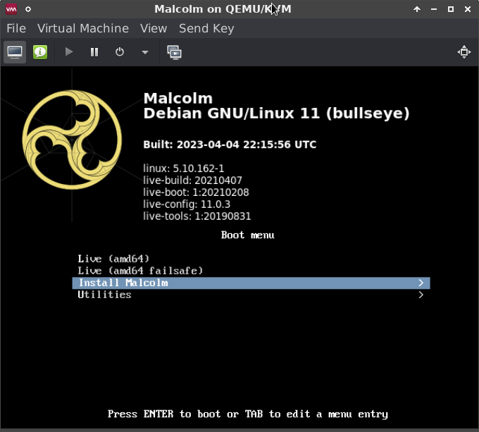
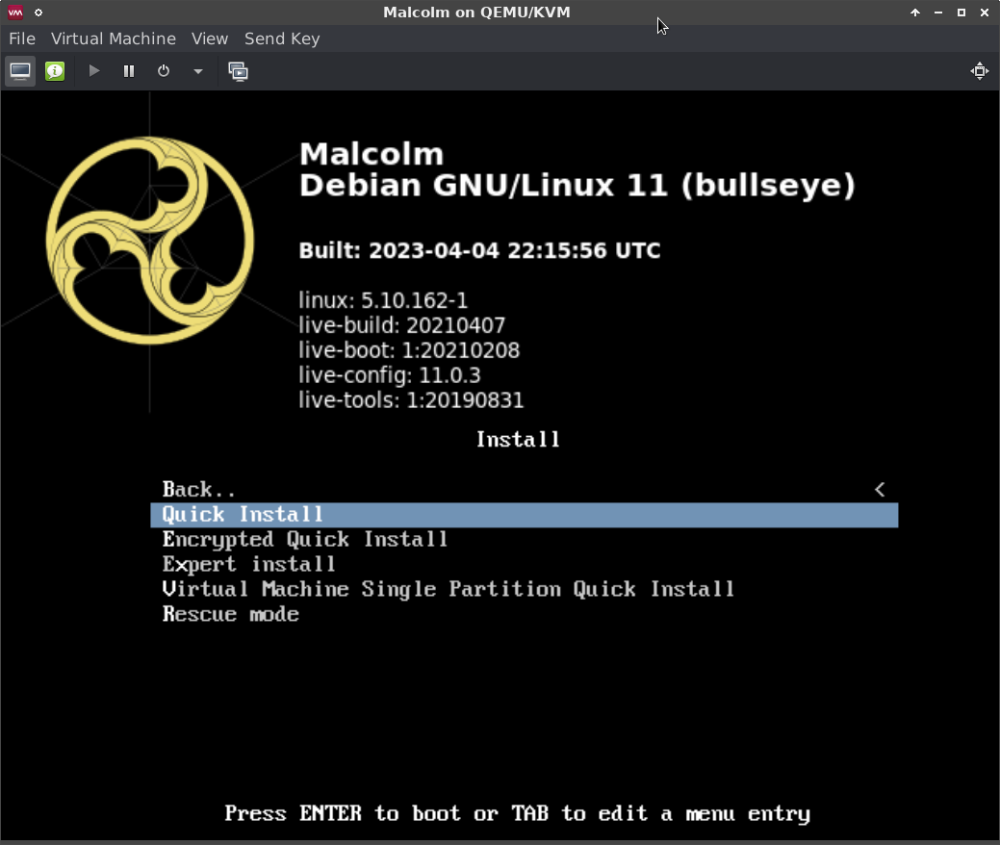

#  End-to-end Malcolm and Hedgehog Linux ISO Installation

This document outlines how to install [Malcolm]({{ site.github.repository_url }}) and [Hedgehog Linux](hedgehog.md) using the project's installer ISOs. These instructions apply to installing this software both on a "bare metal" system or in a virtual machine environment using VMware, VirtualBox, QEMU/KVM, etc.

The Malcolm and Hedgehog Linux installers as described in these instructions are intended to be used to **replace** the existing operating system, if any, of the respective systems onto which they are installed, and, as such, are designed to require as little user input as possible. For this reason, there are NO user prompts and confirmations about partitioning and reformatting hard disks for use by the operating system. The installer assumes that all non-removable storage media (eg., SSD, HDD, NVMe, etc.) are available for use and ⛔🆘😭💀 ***will partition and format them without warning*** 💀😭🆘⛔.

In contrast to using the ISO installer, Malcolm can also be installed "natively" on any x86_64 platform that can run Docker. See the [installation example using Ubuntu 22.04 LTS](ubuntu-install-example.md#InstallationExample) for that method of installation and configuration.

###  Table of Contents

* [Obtaining the Installation ISOs](#ISODownload)
* ["Burning" the Installation ISOs to USB Flash Drive](#ISOBurning)
* [Booting the Installation Media](#BootUSB)
* [Malcolm Installation and Configuration](#MalcolmInstallAndConfig)
    - [Malcolm ISO Installation](#ISOInstallMalcolm)
* [Hedgehog Linux Installation and Configuration](#HedgehogInstallAndConfig)
    - [Hedgehog Linux ISO Installation](#ISOInstallHedgehog)

##  Obtaining the Installation ISOs

Malcolm can be [packaged](malcolm-iso.md#ISOBuild) into an [installer ISO](malcolm-iso.md#ISO) based on the current [stable release](https://wiki.debian.org/DebianStable) of [Debian](https://www.debian.org/). This [customized Debian installation](https://wiki.debian.org/DebianLive) is preconfigured with the bare minimum software needed to run Malcolm.

Similar instructions exist for generating the [installer ISO](hedgehog-iso-build.md#HedgehogISOBuild) for [Hedgehog Linux](hedgehog.md), Malcolm's dedicated network sensor appliance OS.

While official downloads of the Malcolm installer ISO are not provided, an **unofficial build** of the ISO installer for the [latest stable release]({{ site.external_download_url }}) is available for download here. If downloading the unofficial builds, be sure to verify the integrity of ISO files against the SHA256 sums provided on the download page.

##  "Burning" the Installation ISOs to USB Flash Drive

Various methods can be used to write the contents of an installer ISO image to a USB flash drive. One simple free and open source application for doing so [Etcher](https://www.balena.io/etcher), which can be used on Windows, macOS and Linux platforms.

Alternatively, specific instructions may be provided by your operating system (e.g., [Arch Linux](https://wiki.archlinux.org/title/USB_flash_installation_medium), [Debian Linux](https://www.debian.org/releases/stable/amd64/ch04s03.en.html), [Ubuntu Linux](https://ubuntu.com/tutorials/create-a-usb-stick-on-ubuntu#1-overview)). 

Using one of these methods, write the Malcolm and Hedgehog Linux installer ISOs to two 8GB or larger USB flash drives, respectively.

Alternatively, the ISO images could be burned to writable optical media (e.g., DVD±R). For the Malcolm installer you'll likely have to use DVD±R DL ("dual layer" or "double layer") DVD media as the installer ISO exceeds the 4.7 GB storage provided by standard DVDs.

*Using Etcher on macOS*

*Using dd on Linux*

##  Booting the Installation Media

The ISO media boot on systems that support EFI-mode and legacy (BIOS) booting. Configuring your system's firmware to allow booting from USB or optical media will vary from manufacturer to manufacturer. Usually manufacturers will provide a one-time boot options menu upon a specific keypress (e.g., F12 for Dell, F9 for HP, etc.). If needed, consult the documentation provided by the hardware manufacturer on how to access the boot options menu and boot from your newly-burned USB flash media or DVD±R.

*An example of an EFI boot manager in QEMU*

*An example of a BIOS boot options menu in QEMU*

##  Malcolm Installation and Configuration

###  Malcolm ISO Installation

Upon Booting the Malcolm installation ISO, you're presented with the following **Boot menu**. Use the arrow keys to select **Install Malcolm**, and press Enter.

*The first screen of the installer*

The next screen of the installer presents the following options relevant to installation:

* **Quick Install** - Installs Malcolm without full disk encryption using default partitioning.
* **Encrypted Quick Install** - Installs Malcolm with full disk encryption using default partitioning. You will be prompted for a password for full disk encryption during installation which must be entered each time the system boots.
* **Expert Install** - Allows you to configure the options of the [Debian](https://wiki.debian.org/DebianInstaller)-based installation system. Only recommended when needed for expert Linux users.
* **Virtual Machine Single Partition Quick Install** - The same as **Quick Install** except that all system files are stored in a single partition. Use this option when installing Malcolm onto a virtual machine.

*The **Install Malcolm** menu*

After making your selection for the type of Malcolm install to perform, the installer will ask for several pieces of information prior to installing the Malcolm base operating system:

* **Hostname** - the name of the Malcolm system used to identify itself on the network
* **Domain name** - (optional) the name of the local network domain
* **Root password** – (optional) a password for the privileged root account which is rarely needed; if unspecified, the non-privileged user account will be added to the `sudo` group
* **User name** the name for the non-privileged service account user account under which the Malcolm runs
* **User password** – a password for the non-privileged user account
* **Encryption password** – (optional) if the encrypted installation option was selected at boot, the encryption password must be entered every time the system boots

After the passwords have been entered, the installer will proceed to format the system drive and install Malcolm.

At the end of the installation process, you will be prompted with a few self-explanatory yes/no questions:

* **Disable IPv6?**
* **Automatically login to the GUI session?**
* **Should the GUI session be locked due to inactivity?**
* **Display the [Standard Mandatory DoD Notice and Consent Banner](https://www.stigviewer.com/stig/application_security_and_development/2018-12-24/finding/V-69349)?** *(only applies when installed on U.S. government information systems)*

Following these prompts, the installer will reboot and the Malcolm base operating system will boot.

The Malcolm installer does not require an internet connection to complete successfully. If the installer prompts you to configure network connectivity, you may choose "do not configure the network at this time."

##  Hedgehog Linux Installation and Configuration

##  Hedgehog Linux ISO Installation

The Hedgehog Linux installation ISO follows the same process as the [Malcolm installation](#ISOInstallMalcolm) above.

The installer will ask for a few pieces of information prior to installing Hedgehog Linux:

* **Root password** – a password for the privileged root account which is rarely needed (only during the configuration of the sensors network interfaces and setting the sensor host name)
* **User password** – a password for the non-privileged `sensor` account under which the various sensor capture and forwarding services run
* **Encryption password** – (optional) if the encrypted installation option was selected at boot, the encryption password must be entered every time the sensor boots

At the end of the installation process, you will be prompted with a few self-explanatory yes/no questions:

* **Disable IPv6?**
* **Automatically login to the GUI session?**
* **Should the GUI session be locked due to inactivity?**
* **Display the [Standard Mandatory DoD Notice and Consent Banner](https://www.stigviewer.com/stig/application_security_and_development/2018-12-24/finding/V-69349)?** *(only applies when installed on U.S. government information systems)*

Following these prompts, the installer will reboot and Hedgehog Linux will boot.

