# <a name="InstallationExample"></a> End-to-end Malcolm and Hedgehog Linux ISO Installation

This document outlines how to install [Malcolm]({{ site.github.repository_url }}) and [Hedgehog Linux](hedgehog.md) using the project's installer ISOs. These instructions apply to installing this software both on a "bare metal" system or in a virtual machine environment using VMware, VirtualBox, QEMU/KVM, etc.

The Malcolm and Hedgehog Linux installers as described in these instructions are intended to be used to **replace** the existing operating system, if any, of the respective systems onto which they are installed, and, as such, are designed to require as little user input as possible. For this reason, there are NO user prompts and confirmations about partitioning and reformatting hard disks for use by the operating system. The installer assumes that all non-removable storage media (eg., SSD, HDD, NVMe, etc.) are available for use and ⛔🆘😭💀 ***will partition and format them without warning*** 💀😭🆘⛔.

In contrast to using the ISO installer, Malcolm can also be installed "natively" on any x86_64 platform that can run Docker. See the [installation example using Ubuntu 22.04 LTS](ubuntu-install-example.md#InstallationExample) for that method of installation and configuration, or [Windows host system configuration](host-config-windows.md#HostSystemConfigWindows) and [macOS host system configuration](host-config-macos.md#HostSystemConfigMac) for those platforms.

### <a name="TableOfContents"></a> Table of Contents

* [Obtaining the Installation ISOs](#ISODownload)
* ["Burning" the Installation ISOs to USB Flash Drive](#ISOBurning)
* [Booting the Installation Media](#BootUSB)
* [Malcolm Installation and Configuration](#MalcolmInstallAndConfig)
    - [ISO Installation](#ISOInstallMalcolm)
    - [Desktop Environment](#MalcolmDesktop)
    - [Configuration](#MalcolmConfig)
    - [Configure Hostname and Time Sync](#MalcolmTimeSync)
    - [Setting up Authentication](#MalcolmAuthSetup)
* [Hedgehog Linux Installation and Configuration](#HedgehogInstallAndConfig)
    - [Hedgehog Linux ISO Installation](#ISOInstallHedgehog)
    - [Desktop Environment](#HedgehogDesktop)
    - [Configure Hostname, Interfaces and Time Sync](#HedgehogInterfaces)
    - [Configure Capture](#HedgehogCapture)
        + [Capture](#HedgehogConfigCapture)
        + [File extraction and scanning](#HedgehogZeekFileExtraction)
    - [Configure Forwarding](#HedgehogConfigForwarding)
        * [arkime-capture](#Hedgehogarkime-capture): Arkime session forwarding
        * [ssl-client-receive](#HedgehogGetCerts): Receive client SSL files for filebeat from Malcolm
        * [filebeat](#Hedgehogfilebeat): Zeek and Suricata log forwarding
        * [miscbeat](#Hedgehogmiscbeat): System metrics forwarding        
    + [Autostart services](#HedgehogConfigAutostart)
* [Verifying Traffic Capture and Forwarding](#Verify)

## <a name="ISODownload"></a> Obtaining the Installation ISOs

Malcolm can be [packaged](malcolm-iso.md#ISOBuild) into an [installer ISO](malcolm-iso.md#ISO) based on the current [stable release](https://wiki.debian.org/DebianStable) of [Debian](https://www.debian.org/). This [customized Debian installation](https://wiki.debian.org/DebianLive) is preconfigured with the bare minimum software needed to run Malcolm.

Similar instructions exist for generating the [installer ISO](hedgehog-iso-build.md#HedgehogISOBuild) for [Hedgehog Linux](hedgehog.md), Malcolm's dedicated network sensor appliance OS.

While official downloads of the Malcolm installer ISO are not provided, an **unofficial build** of the ISO installer for the [latest stable release]({{ site.external_download_url }}) is available for download here. If downloading the unofficial builds, be sure to verify the integrity of ISO files against the SHA256 sums provided on the download page.

## <a name="ISOBurning"></a> "Burning" the Installation ISOs to USB Flash Drive

Various methods can be used to write the contents of an installer ISO image to a USB flash drive. One simple free and open source application for doing so [Etcher](https://www.balena.io/etcher), which can be used on Windows, macOS and Linux platforms.

Alternatively, specific instructions may be provided by your operating system (e.g., [Arch Linux](https://wiki.archlinux.org/title/USB_flash_installation_medium), [Debian Linux](https://www.debian.org/releases/stable/amd64/ch04s03.en.html), [Ubuntu Linux](https://ubuntu.com/tutorials/create-a-usb-stick-on-ubuntu#1-overview)). 

Using one of these methods, write the Malcolm and Hedgehog Linux installer ISOs to two 8GB or larger USB flash drives, respectively.

Alternatively, the ISO images could be burned to writable optical media (e.g., DVD±R). For the Malcolm installer you'll likely have to use DVD±R DL ("dual layer" or "double layer") DVD media as the installer ISO exceeds the 4.7 GB storage provided by standard DVDs.

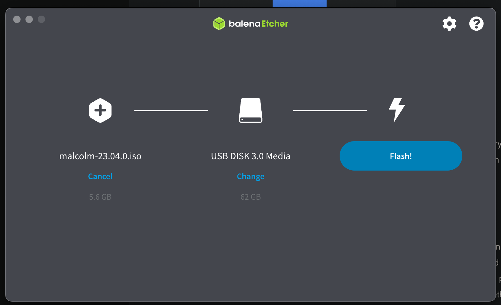

*Using Etcher on macOS*


*Using dd on Linux*

## <a name="BootUSB"></a> Booting the Installation Media

The ISO media boot on systems that support EFI-mode and legacy (BIOS) booting. Configuring your system's firmware to allow booting from USB or optical media will vary from manufacturer to manufacturer. Usually manufacturers will provide a one-time boot options menu upon a specific keypress (e.g., F12 for Dell, F9 for HP, etc.). If needed, consult the documentation provided by the hardware manufacturer on how to access the boot options menu and boot from your newly-burned USB flash media or DVD±R.

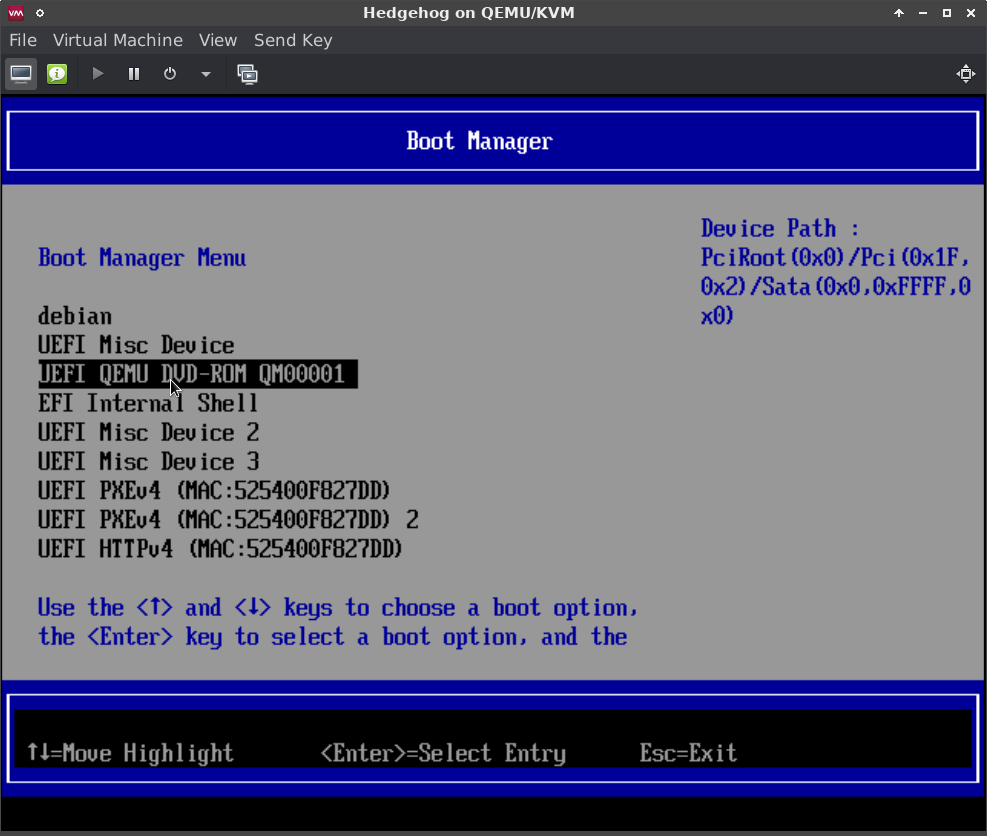

*An example of an EFI boot manager in QEMU*

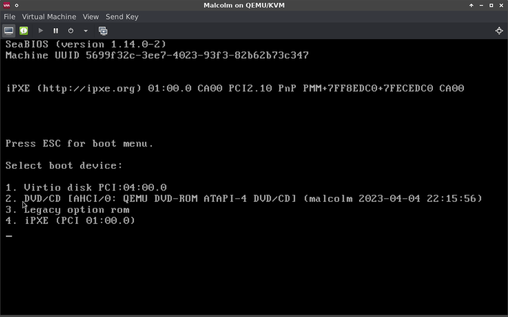

*An example of a BIOS boot options menu in QEMU*

## <a name="MalcolmInstallAndConfig"></a> Malcolm Installation and Configuration

### <a name="ISOInstallMalcolm"></a> ISO Installation

Upon Booting the Malcolm installation ISO, you're presented with the following **Boot menu**. Use the arrow keys to select **Install Malcolm**, and press Enter.


*The first screen of the installer*

The next screen of the installer presents the following options relevant to installation:

* **Quick Install** - Installs Malcolm without full disk encryption using default partitioning.
* **Encrypted Quick Install** - Installs Malcolm with full disk encryption using default partitioning. You will be prompted for a password for full disk encryption during installation which must be entered each time the system boots.
* **Expert Install** - Allows you to configure the options of the [Debian](https://wiki.debian.org/DebianInstaller)-based installation system. Only recommended when needed for expert Linux users.
* **Virtual Machine Single Partition Quick Install** - The same as **Quick Install** except that all system files are stored in a single partition. Use this option when installing Malcolm onto a virtual machine.


*The **Install Malcolm** menu*

After making your selection for the type of Malcolm install to perform, the installer will ask for several pieces of information prior to installing the Malcolm base operating system:

* **Hostname** - the name of the Malcolm system used to identify itself on the network
* **Domain name** - (optional) the name of the local network domain
* **Root password** – (optional) a password for the privileged root account which is rarely needed; if unspecified, the non-privileged user account will be added to the `sudo` group
* **User name** the name for the non-privileged service account user account under which the Malcolm runs
* **User password** – a password for the non-privileged user account
* **Encryption password** – (optional) if the encrypted installation option was selected at boot, the encryption password must be entered every time the system boots


After the passwords have been entered, the installer will proceed to format the system drive and install Malcolm.


At the end of the installation process, you will be prompted with a few self-explanatory yes/no questions:

* **Disable IPv6?**
* **Automatically login to the GUI session?**
* **Should the GUI session be locked due to inactivity?**
* **Display the [Standard Mandatory DoD Notice and Consent Banner](https://www.stigviewer.com/stig/application_security_and_development/2018-12-24/finding/V-69349)?** *(only applies when installed on U.S. government information systems)*

Following these prompts, the installer will reboot and the Malcolm base operating system will boot.

The Malcolm installer does not require an internet connection to complete successfully. If the installer prompts you to configure network connectivity, you may choose "do not configure the network at this time."

### <a name="MalcolmDesktop"></a> Desktop Environment

The Malcolm base operating system is a [hardened](hardening.md#Hardening) Linux installation based on the current [stable release](https://wiki.debian.org/DebianStable) of [Debian](https://www.debian.org/) [running](https://wiki.debian.org/Xfce) the [XFCE desktop environment](https://www.xfce.org/). It has been preloaded with all of the [components](components.md#Components) that make up Malcolm.

[NetworkManager](https://wiki.debian.org/NetworkManager) can be used to configure networking for Malcolm. NetworkManager can be configured by clicking the 🖧 (networked computers) icon in the system tray in the upper-right corner of the screen, or right-clicking the icon and selecting **Edit Connections...** to modify the properties of a given connection.

Display resolution should be detected and adjusted automatically. If you need to make changes to display properties, click the **Applications** menu and select **Settings** → **Display**.

The panel bordering the top of the Malcolm desktop is home to a number of useful shortcuts:

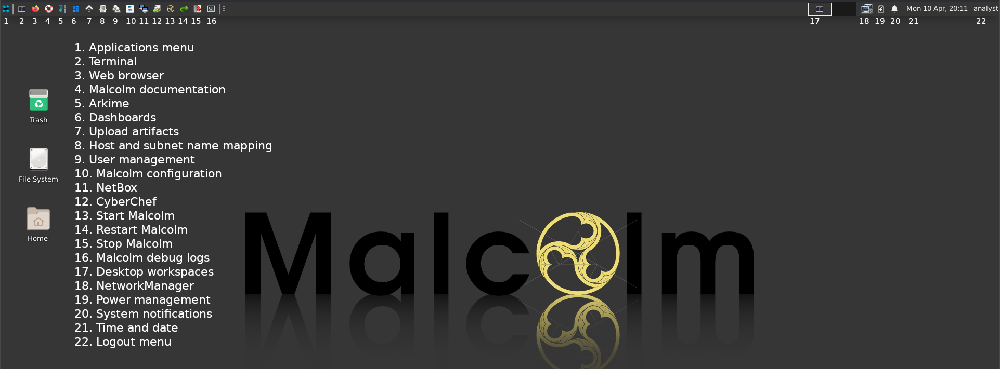

### <a name="MalcolmConfig"></a> Configuration

The first time the Malcolm base operating system boots the **Malcolm Configuration** wizard will start automatically. This same configuration script can be run again later by running [`./scripts/install.py --configure`](malcolm-config.md#ConfigAndTuning) from the Malcolm installation directory, or clicking the **Configure Malcolm** 🔳 icon in the top panel.


The [configuration and tuning](malcolm-config.md#ConfigAndTuning) wizard's questions proceed as follows. Note that you may not necessarily see every question listed here depending on how you answered earlier questions. Usually the default selection is what you'll want to select unless otherwise indicated below.

* Malcolm processes will run as UID 1000 and GID 1000. Is this OK?
    - Docker runs all of its containers as the privileged `root` user by default. For better security, Malcolm immediately drops to non-privileged user accounts for executing internal processes wherever possible. The `PUID` (**p**rocess **u**ser **ID**) and `PGID` (**p**rocess **g**roup **ID**) environment variables allow Malcolm to map internal non-privileged user accounts to a corresponding [user account](https://en.wikipedia.org/wiki/User_identifier) on the host.
* Should Malcolm use and maintain its own OpenSearch instance?
    - Malcolm's default standalone configuration is to use a local [OpenSearch](https://opensearch.org/) instance in a Docker container to index and search network traffic metadata. See [OpenSearch instances](opensearch-instances.md#OpenSearchInstance) for more information about using a remote OpenSearch cluster instead.
* Forward Logstash logs to a secondary remote OpenSearch instance?
    - Whether the primary OpenSearch instance is a locally maintained single-node instance or is a remote cluster, Malcolm can be configured additionally forward logs to a secondary remote OpenSearch instance. See [OpenSearch instances](opensearch-instances.md#OpenSearchInstance) for more information about forwarding logs to another OpenSearch instance.
* Setting 16g for OpenSearch and 3g for Logstash. Is this OK?
    - Two of Malcolm's main components, OpenSearch and Logstash, require a substantial amount of memory to be set aside for their use. The configuration script will suggest defaults for these values based on the amount of physical memory the system has. The minimum recommended amount of system memory for Malcolm is 16 gigabytes. For a pleasant experience, I would suggest not using a value under 10 gigabytes for OpenSearch and 2500 megabytes for Logstash.
* Setting 3 workers for Logstash pipelines. Is this OK?
    - This setting is used to tune the performance and resource utilization of the the `logstash` container. The default is calculated based on the number of logical CPUs the system has. See [Tuning and Profiling Logstash Performance](https://www.elastic.co/guide/en/logstash/current/tuning-logstash.html), [`logstash.yml`](https://www.elastic.co/guide/en/logstash/current/logstash-settings-file.html) and [Multiple Pipelines](https://www.elastic.co/guide/en/logstash/current/multiple-pipelines.html).
* Restart Malcolm upon system or Docker daemon restart?
    - This question allows you to configure Docker's [restart policy](https://docs.docker.com/config/containers/start-containers-automatically/#use-a-restart-policy) for Malcolm (ie., the behavior used to restart Malcolm should the system be shut down or rebooted, or should one of Malcolm's components should crash). Possible options are:
        + no - do not automatically restart the container
        + on-failure - restart the container if it exits due to an error, which manifests as a non-zero exit code
        + always - always restart the container if it stops
        + unless-stopped - similar to always, except that when the container is stopped (manually or otherwise), it is not restarted even after Docker daemon restarts; this is usually a good choice
* Require encrypted HTTPS connections?
    - Malcolm uses [TLS](authsetup.md#TLSCerts) encryption for its web browser-accessible user interfaces. Answering **Y** to this question is almost always what you want. The only situation in which you might want to answer **N** is if you are running Malcolm behind a third-party reverse proxy (e.g., [Traefik](https://doc.traefik.io/traefik/) or [Caddy](https://caddyserver.com/docs/quick-starts/reverse-proxy)) to handle the issuance of the certificates for you and to broker the connections between clients and Malcolm. Reverse proxies such as these often implement the [ACME](https://datatracker.ietf.org/doc/html/rfc8555) protocol for domain name authentication and can be used to request certificates from certificate authorities like [Let's Encrypt](https://letsencrypt.org/how-it-works/). In this configuration, the reverse proxy will be encrypting the connections instead of Malcolm. **Make sure** you understand what you are doing and ensure that external connections cannot reach ports over which Malcolm will be communicating without encryption, including verifying your local firewall configuration, should you choose to answer **N** to this question.
* Will Malcolm be running behind another reverse proxy (Traefik, Caddy, etc.)?
    - See the previous question. If Malcolm is configured behind a remote proxy, Malcolm can prompt you to *Configure labels for Traefik?* to allow it to identify itself to Traefik.
* Specify external Docker network name (or leave blank for default networking)
    - This allows you to configure Malcolm to use [custom Docker networks](https://docs.docker.com/compose/networking/#specify-custom-networks). Leave this blank unless you know you want to do otherwise.
* Select authentication method
    - Choose **Basic** to use Malcolm's own built-in [local account management](authsetup.md#AuthBasicAccountManagement), **LDAP** to use [Lightweight Directory Access Protocol (LDAP) authentication](authsetup.md#AuthLDAP) or **None** to not require authentication (not recommended)
* Select LDAP server compatibility type
    - This question allows you to specify Microsoft Active Directory compatibility (**winldap**) or generic LDAP compatibility (**openldap**, for OpenLDAP, glauth, etc.) when using [LDAP authentication](authsetup.md#AuthLDAP)
* Use StartTLS (rather than LDAPS) for LDAP connection security?
    - When using LDAP authentication, this question allows you to configure [LDAP connection security](authsetup.md#AuthLDAPSecurity)
* Store PCAP, log and index files locally under /home/user/Malcolm?
    - Malcolm generates a number of large file sets during normal operation: PCAP files, Zeek or Suricata logs, OpenSearch indices, etc. By default all of these are stored in subdirectories in the Malcolm installation directory. This question allows you to specify alternative storage location(s) (for example, a separate dedicated drive or RAID volume) for these artifacts.
* Compress OpenSearch index snapshots?
    - Choose whether OpenSearch [index snapshots](https://opensearch.org/docs/2.6/tuning-your-cluster/availability-and-recovery/snapshots/snapshot-management/) should be compressed or not, should you opt to configure them later in [OpenSearch index management](index-management.md#IndexManagement).
* Delete the oldest indices when the database exceeds a certain size?
    - Most of the configuration around OpenSearch [Index State Management](https://opensearch.org/docs/latest/im-plugin/ism/index/) and [Snapshot Management](https://opensearch.org/docs/latest/opensearch/snapshots/sm-dashboards/) can be done in OpenSearch Dashboards. In addition to (or instead of) the OpenSearch index state management operations, Malcolm can also be configured to delete the oldest network session metadata indices when the database exceeds a certain size to prevent filling up all available storage with OpenSearch indices.
* Automatically analyze all PCAP files with Suricata?
    - This option is used to enable [Suricata](https://suricata.io/) (an IDS and threat detection engine) to analyze PCAP files uploaded to Malcolm via its upload web interface.
* Download updated Suricata signatures periodically?
    - If your Malcolm instance has internet connectivity, answer **Y** to [enable automatic updates](https://suricata-update.readthedocs.io/en/latest/) of the Suricata rules used by Malcolm.
* Automatically analyze all PCAP files with Zeek?
    - This option is used to enable [Zeek](https://www.zeek.org/index.html) (a network analysis framework and IDS) to analyze PCAP files uploaded to Malcolm via its upload web interface.
* Perform reverse DNS lookup locally for source and destination IP addresses in logs?
    - If enabled, this option will perform reverse [DNS lookups](https://www.elastic.co/guide/en/logstash/current/plugins-filters-dns.html) on IP addresses found in traffic and use the results to enrich network logs. Answer **Y** if your Malcolm instance has access to a DNS server to perform these lookups.
* Perform hardware vendor OUI lookups for MAC addresses?
    - Malcolm will [map MAC addresses](https://standards.ieee.org/products-programs/regauth/) to hardware manufacturer when possible. You probably want to answer **Y** to this question.
* Perform string randomness scoring on some fields?
    - If enabled, domain names observed in network traffic (from DNS queries and SSL server names) will be assigned entropy scores as calculated by [`freq`](https://github.com/MarkBaggett/freq). You probably want to answer **Y** to this question.
* Expose OpenSearch port to external hosts?
    - Answer **Y** in order for Malcolm's firewall to allow connections from a remote log forwarder (such as Hedgehog Linux) to TCP port 9200 so that Arkime sessions can be written to Malcolm's OpenSearch database.
* Expose Logstash port to external hosts?
    - Answer **Y** in order for Malcolm's firewall to allow connections from a remote log forwarder (such as Hedgehog Linux) to TCP port 5044 so that Zeek and Suricata logs can be ingested by Malcolm's Logstash instance.
* Expose Filebeat TCP port to external hosts?
    - Answer **Y** in order for Malcolm's firewall to allow connections from a remote log forwarder (such as Hedgehog Linux for resource utilization metrics or other forwarders for other [third-Party logs](third-party-logs.md#ThirdPartyLogs)) to TCP port 5045.
* Select log format for messages sent to Filebeat TCP listener
    - Possible choices include `json` and `raw`; you probably want to choose `json`.
* Source field to parse for messages sent to Filebeat TCP listener
    - The default choice (and the one Hedgehog Linux will be sending) is `message`.
* Target field under which to store decoded JSON fields for messages sent to Filebeat TCP listener
    - The default choice (and the one that corresponds to Malcolm's dashboards built for the resource utilization metrics sent by Hedgehog Linux) is `miscbeat`.
* Field to drop from events sent to Filebeat TCP listener
    - You most likely want this to be the default, `message`, to match the field name specified above.
* Tag to apply to messages sent to Filebeat TCP listener
    - The default is `_malcolm_beats`, which is used by Malcolm to recognize and parse metrics sent from Hedgehog Linux.
* Expose SFTP server (for PCAP upload) to external hosts?
    - Answer **N** unless you plan to use SFTP/SCP to [upload](upload.md#Upload) PCAP files to Malcolm; answering **Y** will expose TCP port 8022 in Malcolm's firewall for SFTP/SCP connections
* Enable file extraction with Zeek?
    - Answer **Y** to indicate that Zeek should [extract files](file-scanning.md#ZeekFileExtraction) transfered in observed network traffic.
* Select file extraction behavior
    - This determines which files Zeek should extract for scanning:
        + `none`: no file extraction
        + `interesting`: extraction of files with mime types of common attack vectors
        + `mapped`: extraction of files with recognized mime types
        + `known`: extraction of files for which any mime type can be determined
        + `all`: extract all files
* Select file preservation behavior
    - This determines the behavior for preservation of Zeek-extracted files:
        +  `quarantined`: preserve only flagged files in `./zeek-logs/extract_files/quarantine`
        + `all`: preserve flagged files in `./zeek-logs/extract_files/quarantine` and all other extracted files in `./zeek-logs/extract_files/preserved`
        + `none`: preserve no extracted files
* Expose web interface for downloading preserved files?
    - Answering **Y** enables access to the Zeek-extracted files path through the means of a simple HTTPS directory server at `https://<Malcolm host or IP address>/extracted-files/`. Beware that Zeek-extracted files may contain malware.
* Enter AES-256-CBC encryption password for downloaded preserved files (or leave blank for unencrypted)
    - If a password is specified here, Zeek-extracted files downloaded as described under the previous question will be AES-256-CBC-encrypted in an `openssl enc`-compatible format (e.g., `openssl enc -aes-256-cbc -d -in example.exe.encrypted -out example.exe`).
* Scan extracted files with ClamAV?
    - Answer **Y** to scan extracted files with [ClamAV](https://www.clamav.net/), an antivirus engine.
* Scan extracted files with Yara?
    - Answer **Y** to scan extracted files with [Yara](https://github.com/VirusTotal/yara), a tool used to identify and classify malware samples.
* Scan extracted PE files with Capa?
    - Answer **Y** to scan extracted executable files with [Capa](https://github.com/fireeye/capa), a tool for detecting capabilities in executable files.
* Lookup extracted file hashes with VirusTotal?
    - Answer **Y** to be prompted for your [**VirusTotal**](https://www.virustotal.com/en/#search) API key which will be used for submitting the hashes of extracted files. Only specify this option if your Malcolm instance has internet connectivity.
* Enter VirusTotal API key
    - Specify your [**VirusTotal**](https://www.virustotal.com/en/#search) [API key](https://support.virustotal.com/hc/en-us/articles/115002100149-API) as indicated under the previous question.
* Download updated file scanner signatures periodically?
    - If your Malcolm instance has internet connectivity, answer **Y** to enable periodic downloads of signatures used by ClamAV and YARA.
* Should Malcolm run and maintain an instance of NetBox, an infrastructure resource modeling tool?
    - Answer **Y** if you would like to use [NetBox](https://netbox.dev/), a suite for modeling and documenting modern networks, to maintain an inventory of your network assets.    
* Should Malcolm enrich network traffic using NetBox?
    - Answer **Y** to [cross-reference](asset-interaction-analysis.md#AssetInteractionAnalysis) network traffic logs your NetBox asset inventory.
* Specify default NetBox site name
    - NetBox has the concept of [sites](https://demo.netbox.dev/static/docs/core-functionality/sites-and-racks/). Sites can have overlapping IP address ranges, of course. This default site name will be used as a query parameter for these enrichment lookups.
* Should Malcolm capture live network traffic to PCAP files for analysis with Arkime?
    - Malcolm itself can perform [live analysis](live-analysis.md#LocalPCAP) of traffic it sees on another network interface (ideally not the same one used for its management). If you are using Hedgehog Linux you probably want to answer **N** to this question. If you want Malcolm to observe and capture traffic instead of or in addition to a sensor running Hedgehog Linux, answer **Y**.
* Capture packets using netsniff-ng?
    - Answer **Y** for Malcolm to [capture network traffic](live-analysis.md#LocalPCAP) on the local network interface(s) indicated using [netsniff-ng](http://netsniff-ng.org/) (instead of tcpdump). These PCAP files are then periodically rotated into Arkime for analysis. netsniff-ng is Malcolm's preferred tool for capturing network traffic.
* Capture packets using tcpdump?
    - Answer **Y** for Malcolm to [capture network traffic](live-analysis.md#LocalPCAP) on the local network interface(s) indicated using [tcpdump](https://www.tcpdump.org/) (instead of netsniff-ng). Do not answer **Y** for both `tcpdump` and `netsniff-ng`.
* Should Arkime delete PCAP files based on available storage?
    - Answering **Y** allows Arkime to prune (delete) old PCAP files based on available disk space (see https://arkime.com/faq#pcap-deletion).
* Should Malcolm analyze live network traffic with Suricata?
    - Answering **Y** will allow Malcolm itself to perform [live traffic analysis](live-analysis.md#LocalPCAP) using Suricata. If you are using Hedgehog Linux you probably want to answer **N** to this question. See the question above above about "captur[ing] live network traffic."
* Should Malcolm analyze live network traffic with Zeek?
    - Answering **Y** will allow Malcolm itself to perform [live traffic analysis](live-analysis.md#LocalPCAP) using Zeek. If you are using Hedgehog Linux you probably want to answer **N** to this question. See the question above above about "captur[ing] live network traffic."
* Should Malcolm use "best guess" to identify potential OT/ICS traffic with Zeek?
    - If you are using Malcolm in a control systems (OT/ICS) network, answer **Y** to enable ["Best Guess" Fingerprinting for ICS Protocols](ics-best-guess.md#ICSBestGuess).
* Specify capture interface(s) (comma-separated)
    - Specify the network interface(s) for [live traffic analysis](live-analysis.md#LocalPCAP) if it is enabled for netsniff-ng, tcpdump, Suricata or Zeek as described above. For multiple interfaces, separate the interface names with a comma (e.g., `enp0s25` or `enp10s0,enp11s0`).
* Capture filter (tcpdump-like filter expression; leave blank to capture all traffic)
    - If Malcolm is doing its own [live traffic analysis](live-analysis.md#LocalPCAP) as described above, you may optionally provide a capture filter. This filter will be used to limit what traffic the PCAP service ([netsniff-ng](http://netsniff-ng.org/) or [tcpdump](https://www.tcpdump.org/)) and the traffic analysis services ([Zeek](https://www.zeek.org/) and [Suricata](https://suricata.io/)) will see. Capture filters are specified using [Berkeley Packet Filter (BPF)](http://biot.com/capstats/bpf.html) syntax. For example, to indicate that Malcolm should ignore the ports it uses to communicate with Hedgehog Linux, you could specify `not port 5044 and not port 5045 and not port 8005 and not port 9200`.
* Disable capture interface hardware offloading and adjust ring buffer sizes?
    - If Malcolm is doing its own [live traffic analysis](live-analysis.md#LocalPCAP) and you answer **Y** to this question, Malcolm will [use `ethtool`]({{ site.github.repository_url }}/blob/{{ site.github.build_revision }}/shared/bin/nic-capture-setup.sh) to disable NIC hardware offloading features and adjust ring buffer sizes for capture interface(s); this should be enabled if the interface(s) are being used for capture **only**, otherwise answer **N**. If you're unsure, you should probably answer **N**.
* Enable dark mode for OpenSearch Dashboards?
    - Answer **Y** if you prefer dark dashboards, **N** if you prefer light ones.

### <a name="MalcolmTimeSync"></a> Configure Hostname and Time Sync

If you wish to change Malcolm's hostname or configure system time synchronization, open a terminal (the icon immediately to the right of the **Applications** menu icon at the top of the Malcolm desktop) and run `sudo configure-interfaces.py` then enter your password. If you get an error about your user not belonging to the `sudo` group, run `su -c configure-interfaces.py` and use the `root` password instead.

Here you can configure Malcolm to keep its time synchronized with either an NTP server (using the NTP protocol), another [Malcolm]({{ site.github.repository_url }}) aggregator or another HTTP/HTTPS server. On the next dialog, choose the time synchronization method you wish to configure.


If **htpdate** is selected, you will be prompted to enter the IP address or hostname and port of an HTTP/HTTPS server (for another Malcolm instance, port `9200` may be used) and the time synchronization check frequency in minutes. A test connection will be made to determine if the time can be retrieved from the server.


If *ntpdate* is selected, you will be prompted to enter the IP address or hostname of the NTP server.


Upon configuring time synchronization, a "Time synchronization configured successfully!" message will be displayed, after which you will be returned to the welcome screen. Select **Cancel**.

### <a name="MalcolmAuthSetup"></a> Setting up Authentication

Once the [configuration](#MalcolmConfig) questions have been completed as described above, you can click the circular yellow Malcolm icon the panel at the top of the [desktop](#MalcolmDesktop) to start Malcolm. As you have not yet configured authentication, you will be prompted to do so. This authentication setup can be run again later by running [`./scripts/auth_setup`](authsetup.md#AuthSetup) from the Malcolm installation directory.


*The Configure Authentication dialog*

As this is the first time setting up authentication, ensure the **all** option is selected and press **OK**.

You will be prompted to do the following:

* Store administrator username/password for local Malcolm access: specifies the administrator credentials when using [local account management](#AuthBasicAccountManagement) (instead of LDAP) for authentication.
* (Re)generate self-signed certificates for HTTPS access: creates the self-signed [TLS certificates](authsetup.md#TLSCerts) used for encrypting the connections between users' web browsers and Malcolm
* (Re)generate self-signed certificates for a remote log forwarder: creates the self-signed [TLS certificates](authsetup.md#TLSCerts) for communications from a remote log forwarder (such as Hedgehog Linux or forwarders for other [third-Party logs](third-party-logs.md#ThirdPartyLogs))
* Configure remote primary or secondary OpenSearch instance: **N** if you are using Malcolm's local OpenSearch instance, or **Y** to specify credentials for a remote OpenSearch cluster (see [OpenSearch instances](opensearch-instances.md#OpenSearchInstance))
* Store username/password for email alert sender account: answer **Y** to specify credentials for [Email Sender Accounts](alerting.md#AlertingEmail) to be used with OpenSearch Dashboards' alerting plugin
* (Re)generate internal passwords for NetBox: if you answered **Y** to "Should Malcolm run and maintain an instance of NetBox...?" during the configuration questions, you should need to asnwer **Y** to this question at least the first time you start Malcolm
* Transfer self-signed client certificates to a remote log forwarder: in order for a Hedgehog Linux to securely communicate with Malcolm, it needs the client certificates generated when you answered **Y** to "(Re)generate self-signed certificates for a remote log forwarder" a few moments ago. Malcolm can facilitate the secure transfer of these to a sensor running Hedgehog. If you will be continuing on to configure a sensor running Hedgehog Linux, answer **Y** here.
    - You're prompted to "Run configure-capture on the remote log forwarder, select 'Configure Forwarding,' then 'Receive client SSL files...'." Continue on with the instructions for [Hedgehog Linux Installation and Configuration](#HedgehogInstallAndConfig), and return here and press **Enter** when you get to **[ssl-client-receive](#HedgehogGetCerts): Receive client SSL files for filebeat from Malcolm** below. After that process is complete, press **OK** and Malcolm will continue to start up.

## <a name="HedgehogInstallAndConfig"></a> Hedgehog Linux Installation and Configuration

More detailed instructions for configuring Hedgehog Linux can be found in that section of the [documentation](hedgehog.md).

## <a name="ISOInstallHedgehog"></a> Hedgehog Linux ISO Installation

The Hedgehog Linux installation ISO follows the same process as the [Malcolm installation](#ISOInstallMalcolm) above.

The installer will ask for a few pieces of information prior to installing Hedgehog Linux:

* **Root password** – a password for the privileged root account which is rarely needed (only during the configuration of the sensors network interfaces and setting the sensor host name)
* **User password** – a password for the non-privileged `sensor` account under which the various sensor capture and forwarding services run
* **Encryption password** – (optional) if the encrypted installation option was selected at boot, the encryption password must be entered every time the sensor boots

At the end of the installation process, you will be prompted with a few self-explanatory yes/no questions:

* **Disable IPv6?**
* **Automatically login to the GUI session?**
* **Should the GUI session be locked due to inactivity?**
* **Display the [Standard Mandatory DoD Notice and Consent Banner](https://www.stigviewer.com/stig/application_security_and_development/2018-12-24/finding/V-69349)?** *(only applies when installed on U.S. government information systems)*

Following these prompts, the installer will reboot and Hedgehog Linux will boot into [kiosk mode](hedgehog-boot.md#HedgehogKioskMode).

Kiosk mode can be exited by connecting an external USB keyboard and pressing **Alt+F4**, upon which the *sensor* user's desktop is shown.

### <a name="HedgehogDesktop"></a> Desktop Environment

The Hedgehog Linux base operating system is a [hardened](hedgehog-hardening.md#HedgehogHardening) Linux installation based on the current [stable release](https://wiki.debian.org/DebianStable) of [Debian](https://www.debian.org/) [running](https://wiki.debian.org/Xfce) the [XFCE desktop environment](https://www.xfce.org/). 

Display resolution should be detected and adjusted automatically. If you need to make changes to display properties, click the **Applications** menu and select **Settings** → **Display**.

The panel bordering the top of the Malcolm desktop is home to a number of useful shortcuts:


*The Hedgehog Linux desktop*

* **Terminal** - opens a command prompt in a terminal emulator
* **Browser** - opens a web browser
* **Kiosk** – returns the sensor to kiosk mode
* **README** – displays this document
* **Sensor status** – displays a list with the status of each sensor service
* **Configure capture and forwarding** – opens a dialog for configuring the sensor's capture and forwarding services, as well as specifying which services should autostart upon boot
* **Configure interfaces and hostname** – opens a dialog for configuring the sensor's network interfaces and setting the sensor's hostname
* **Restart sensor services** - stops and restarts all of the [autostart services](#HedgehogConfigAutostart)

## <a name="HedgehogInterfaces"></a> Configure Hostname, Interfaces and Time Sync

The first step of sensor configuration is to configure the network interfaces and sensor hostname. Clicking the **Configure Interfaces and Hostname** toolbar icon (or, if you are at a command line prompt, running `configure-interfaces`) will prompt you for the root password you created during installation, after which the configuration welcome screen is shown. Select **Continue** to proceed.

You may next select whether to configure the network interfaces, hostname, or time synchronization.


Selecting **Hostname**, you will be presented with a summary of the current sensor identification information, after which you may specify a new sensor hostname.  This name will be used to tag all events forwarded from this sensor in the events' **host.name** field.


Returning to the configuration mode selection, choose **Interface**. You will be prompted if you would like help identifying network interfaces. If you select **Yes**, you will be prompted to select a network interface, after which that interface's link LED will blink for 10 seconds to help you in its identification. This network interface identification aid will continue to prompt you to identify further network interfaces until you select **No**.

You will be presented with a list of interfaces to configure as the sensor management interface. This is the interface the sensor itself will use to communicate with the network in order to, for example, forward captured logs to an aggregate server. In order to do so, the management interface must be assigned an IP address. This is generally **not** the interface used for capturing data. Select the interface to which you wish to assign an IP address. The interfaces are listed by name and MAC address and the associated link speed is also displayed if it can be determined. For interfaces without a connected network cable, generally a `-1` will be displayed instead of the interface speed.

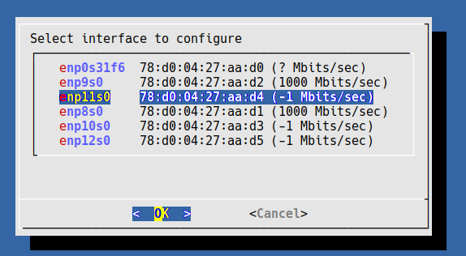

Depending on the configuration of your network, you may now specify how the management interface will be assigned an IP address. In order to communicate with an event aggregator over the management interface, either **static** or **dhcp** must be selected.

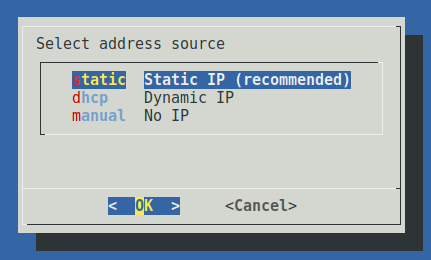

If you select static, you will be prompted to enter the IP address, netmask, and gateway to assign to the management interface.

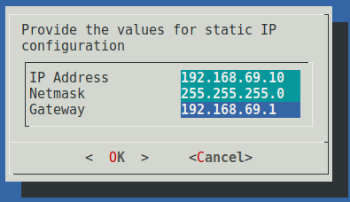

In either case, upon selecting **OK** the network interface will be brought down, configured, and brought back up, and the result of the operation will be displayed. You may choose **Quit** upon returning to the configuration tool's welcome screen.

Returning to the configuration mode selection, choose **Time Sync**. Here you can configure the sensor to keep its time synchronized with either an NTP server (using the NTP protocol) or a local [Malcolm]({{ site.github.repository_url }}) aggregator or another HTTP/HTTPS server. On the next dialog, choose the time synchronization method you wish to configure.


If **htpdate** is selected, you will be prompted to enter the IP address or hostname and port of an HTTP/HTTPS server (for a Malcolm instance, port `9200` may be used) and the time synchronization check frequency in minutes. A test connection will be made to determine if the time can be retrieved from the server.


If *ntpdate* is selected, you will be prompted to enter the IP address or hostname of the NTP server.


Upon configuring time synchronization, a "Time synchronization configured successfully!" message will be displayed, after which you will be returned to the welcome screen. Select **Cancel**.

## <a name="HedgehogCapture"></a> Configure Capture

Clicking the **Configure Capture and Forwarding** toolbar icon (or, if you are at a command prompt, running `configure-capture`) will launch the configuration tool for capture and forwarding. The root password is not required as it was for the interface and hostname configuration, as sensor services are run under the non-privileged sensor account. Select **Continue** to proceed. You may select from a list of configuration options.

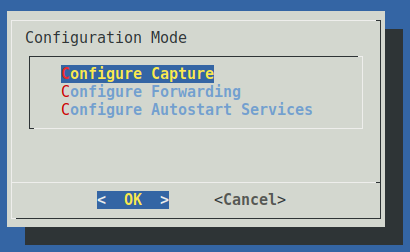

### <a name="HedgehogConfigCapture"></a>Capture

Choose **Configure Capture** to configure parameters related to traffic capture and local analysis. You will be prompted if you would like help identifying network interfaces. If you select **Yes**, you will be prompted to select a network interface, after which that interface's link LED will blink for 10 seconds to help you in its identification. This network interface identification aid will continue to prompt you to identify further network interfaces until you select **No**.

You will be presented with a list of network interfaces and prompted to select one or more capture interfaces. An interface used to capture traffic is generally a different interface than the one selected previously as the management interface, and each capture interface should be connected to a network tap or span port for traffic monitoring. Capture interfaces are usually not assigned an IP address as they are only used to passively “listen” to the traffic on the wire. The interfaces are listed by name and MAC address and the associated link speed is also displayed if it can be determined. For interfaces without a connected network cable, generally a `-1` will be displayed instead of the interface speed.


Upon choosing the capture interfaces and selecting OK, you may optionally provide a capture filter. This filter will be used to limit what traffic the PCAP service ([netsniff-ng](http://netsniff-ng.org/) or [tcpdump](https://www.tcpdump.org/)) and the traffic analysis services ([`zeek`](https://www.zeek.org/) and [`suricata`](https://suricata.io/)) will see. Capture filters are specified using [Berkeley Packet Filter (BPF)](http://biot.com/capstats/bpf.html) syntax. For example, to indicate that Hedgehog should ignore the ports it uses to communicate with Malcolm, you could specify `not port 5044 and not port 5045 and not port 8005 and not port 9200`. Clicking **OK** will attempt to validate the capture filter, if specified, and will present a warning if the filter is invalid.

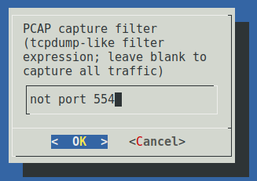

Next you must specify the paths where captured PCAP files and logs will be stored locally on the sensor. If the installation worked as expected, these paths should be prepopulated to reflect paths on the volumes formatted at install time for the purpose storing these artifacts. Usually these paths will exist on separate storage volumes. Enabling the PCAP and log pruning autostart services (see the section on autostart services below) will enable monitoring of these paths to ensure that their contents do not consume more than 90% of their respective volumes' space. Choose **OK** to continue.


### <a name="HedgehogZeekFileExtraction"></a>File extraction and scanning

Hedgehog Linux can leverage Zeek's knowledge of network protocols to automatically detect file transfers and extract those files from network traffic as Zeek sees them.

To specify which files should be extracted, specify the Zeek file carving mode:


If you're not sure what to choose, either of **mapped (except common plain text files)** (if you want to carve and scan almost all files) or **interesting** (if you only want to carve and scan files with [mime types of common attack vectors]({{ site.github.repository_url }}/blob/{{ site.github.build_revision }}/sensor-iso/interface/sensor_ctl/zeek/extractor_override.interesting.zeek)) is probably a good choice.

Next, specify which carved files to preserve (saved on the sensor under `/capture/bro/capture/extract_files/quarantine` by default). In order to not consume all of the sensor's available storage space, the oldest preserved files will be pruned along with the oldest Zeek logs as described below with **AUTOSTART_PRUNE_ZEEK** in the [autostart services](#HedgehogConfigAutostart) section.

You'll be prompted to specify which engine(s) to use to analyze extracted files. Extracted files can be examined through any of three methods:


* scanning files with [**ClamAV**](https://www.clamav.net/); to enable this method, select **ZEEK_FILE_SCAN_CLAMAV** when specifying scanners for Zeek-carved files
* submitting file hashes to [**VirusTotal**](https://www.virustotal.com/en/#search); to enable this method, select **ZEEK_FILE_SCAN_VTOT** when specifying scanners for Zeek-carved files, then manually edit `/opt/sensor/sensor_ctl/control_vars.conf` and specify your [VirusTotal API key](https://developers.virustotal.com/reference) in `VTOT_API2_KEY`
* scanning files with [**Yara**](https://github.com/VirusTotal/yara); to enable this method, select **ZEEK_FILE_SCAN_YARA** when specifying scanners for Zeek-carved files
* scanning portable executable (PE) files with [**Capa**](https://github.com/fireeye/capa); to enable this method, select **ZEEK_FILE_SCAN_CAPA** when specifying scanners for Zeek-carved files

Files which are flagged as potentially malicious will be logged as Zeek `signatures.log` entries, and can be viewed in the **Signatures** dashboard in [OpenSearch Dashboards]({{ site.github.repository_url }}#DashboardsVisualizations) when forwarded to Malcolm.


Finally, you will be presented with the list of configuration variables that will be used for capture, including the values which you have configured up to this point in this section. Upon choosing **OK** these values will be written back out to the sensor configuration file located at `/opt/sensor/sensor_ctl/control_vars.conf`. It is not recommended that you edit this file manually. After confirming these values, you will be presented with a confirmation that these settings have been written to the configuration file, and you will be returned to the welcome screen.

## <a name="HedgehogConfigForwarding"></a> Configure Forwarding

Select **Configure Forwarding** to set up forwarding logs and statistics from the sensor to an aggregator server, such as [Malcolm]({{ site.github.repository_url }}).


There are three forwarder services used on the sensor, each for forwarding a different type of log or sensor metric.

### <a name="Hedgehogarkime-capture"></a>arkime-capture: Arkime session forwarding

arkime-[capture](https://github.com/arkime/arkime/tree/master/capture) is not only used to capture PCAP files, but also the parse raw traffic into sessions and forward this session metadata to an [OpenSearch](https://opensearch.org/) database so that it can be viewed in [Arkime viewer](https://arkime.com/), whether standalone or as part of a [Malcolm]({{ site.github.repository_url }}) instance. If you're using Hedgehog Linux with Malcolm, please read [Correlating Zeek logs and Arkime sessions]({{ site.github.repository_url }}#ZeekArkimeFlowCorrelation) in the Malcolm documentation for more information.

First, select the OpenSearch connection transport protocol, either **HTTPS** or **HTTP**. If the metrics are being forwarded to Malcolm, select **HTTPS** to encrypt messages from the sensor to the aggregator using TLS v1.2 using ECDHE-RSA-AES128-GCM-SHA256. If **HTTPS** is chosen, you must choose whether to enable SSL certificate verification. If you are using a self-signed certificate (such as the one automatically created during [Malcolm's configuration]({{ site.github.repository_url }}#configure-authentication)), choose **None**.

 

Next, enter the **OpenSearch host** IP address (ie., the IP address of the aggregator) and port. These metrics are written to an OpenSearch database using a RESTful API, usually using port 9200. Depending on your network configuration, you may need to open this port in your firewall to allow this connection from the sensor to the aggregator.


You will be asked to enter authentication credentials for the sensor's connections to the aggregator's OpenSearch API. After you've entered the username and the password, the sensor will attempt a test connection to OpenSearch using the connection information provided. If the Malcolm services have not yet been started, you may receive a **Connection refused** error. You may select **Ignore Error** for the credentials to be accepted anyway.

  

You will be shown a dialog for a list of IP addresses used to populate an access control list (ACL) for hosts allowed to connect back to the sensor for retrieving session payloads from its PCAP files for display in Arkime viewer. The list will be prepopulated with the IP address entered a few screens prior to this one.


Arkime supports [compression](https://arkime.com/settings#writer-simple) for the PCAP files it creates. Select `none` (at the cost of requiring more storage for PCAP files saved on the sensor) or `zstd` (at the cost of higher CPU load when writing and reading PCAP files). If you choose [`zstd`](https://en.wikipedia.org/wiki/Zstd?lang=en), you'll also be prompted for the compression level (something like `3` is probably a good choice).

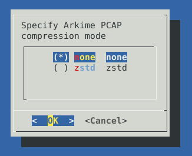

Finally, you'll be given the opportunity to review the all of the Arkime `capture` options you've specified. Selecting **OK** will cause the parameters to be saved and you will be returned to the configuration tool's welcome screen.


### <a name="HedgehogGetCerts"></a>ssl-client-receive: Receive client SSL files for filebeat from Malcolm

As described above in the Malcolm configuration under [Setting up Authentication](#MalcolmAuthSetup), in order for a Hedgehog Linux to securely communicate with Malcolm, it needs the client certificates generated when you answered **Y** to "(Re)generate self-signed certificates for a remote log forwarder" during that setup. Malcolm can facilitate the secure transfer of these to a sensor running Hedgehog.


*Select* ***ssl-client-receive*** *on Hedgehog*

Select **ssl-client-receive** from the **Configuration Mode** options on the Hedgehog, then press **OK** when prompted "Run auth_setup on Malcolm 'Transfer self-signed client certificates...'." [Return](#MalcolmAuthSetup) to the Malcolm instance where `auth_setup` is running (or re-run it if needed) and press **OK**. You'll see a message with the title **ssl-client-transmit** that looks like this:


*Run* ***auth_setup*** *and select* ***ssl-client-transmit*** *on Malcolm*

Note Malcolm's IP address (`192.168.122.5` in the screenshot above) and the single-use code phrase (`8736-janet-kilo-tonight` in the screenshot above) and enter them on the Hedgehog:


*Enter Malcolm IP address and single-use code phrase on Hedgehog*

After a few seconds (hopefully) a progress bar will update and show the files have been 100% transfered. They are automatically saved into the `/opt/sensor/sensor_ctl/logstash-client-certificates` directory on the sensor.

Press **OK** on the Malcolm instance. If Malcolm's `auth_setup` process was being during Malcolm's first run, Malcolm will continue to start up.

### <a name="Hedgehogfilebeat"></a>filebeat: Zeek and Suricata log forwarding

[Filebeat](https://www.elastic.co/products/beats/filebeat) is used to forward [Zeek](https://www.zeek.org/) and [Suricata](https://suricata.io/) logs to a remote [Logstash](https://www.elastic.co/products/logstash) instance for further enrichment prior to insertion into an [OpenSearch](https://opensearch.org/) database.

To configure filebeat, first provide the log path (the same path previously configured for log file generation).


You must also provide the IP address of the Logstash instance to which the logs are to be forwarded, and the port on which Logstash is listening. These logs are forwarded using the Beats protocol, generally over port 5044. Depending on your network configuration, you may need to open this port in your firewall to allow this connection from the sensor to the aggregator.

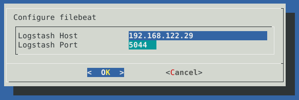

Next you are asked whether the connection used for log forwarding should be done **unencrypted** or over **SSL**. Unencrypted communication requires less processing overhead and is simpler to configure, but the contents of the logs may be visible to anyone who is able to intercept that traffic.


If **SSL** is chosen, you must choose whether to enable [SSL certificate verification](https://www.elastic.co/guide/en/beats/filebeat/current/configuring-ssl-logstash.html). If you are using a self-signed certificate (such as the one automatically created during [Malcolm's configuration]({{ site.github.repository_url }}#configure-authentication), choose **None**.


The last step for SSL-encrypted log forwarding is to specify the SSL certificate authority, certificate, and key files. These files must match those used by the Logstash instance receiving the logs on the aggregator. The steps above under **[ssl-client-receive](#HedgehogGetCerts): Receive client SSL files for filebeat from Malcolm** should have taken care of the transfer of these files between Malcolm and Hedgehog. Otherwise, manually copy ("sneakernet") the files from  the `filebeat/certs/` subdirectory of the Malcolm installation to `/opt/sensor/sensor_ctl/logstash-client-certificates` on Hedgehog.


Once you have specified all of the filebeat parameters, you will be presented with a summary of the settings related to the forwarding of these logs. Selecting **OK** will cause the parameters to be written to filebeat's configuration keystore under `/opt/sensor/sensor_ctl/logstash-client-certificates` and you will be returned to the configuration tool's welcome screen. If the Malcolm services have not yet been started, you may receive a **could not connect** error. You may select **Ignore Error** for the settings to be accepted anyway.


### <a name="Hedgehogmiscbeat"></a>miscbeat: System metrics forwarding

The sensor uses [Fluent Bit](https://fluentbit.io/) to gather miscellaneous system resource metrics (CPU, network I/O, disk I/O, memory utilization, temperature, etc.) and the [Beats](https://www.elastic.co/guide/en/beats/filebeat/current/filebeat-input-tcp.html) protocol to forward these metrics to a remote [Logstash](https://www.elastic.co/products/logstash) instance for further enrichment prior to insertion into an [OpenSearch](https://opensearch.org/) database. Metrics categories can be enabled/disabled as described in the [autostart services](#HedgehogConfigAutostart) section of this document.

This forwarder's configuration is almost identical to that of [filebeat](#Hedgehogfilebeat) in the previous section. Select `miscbeat` from the forwarding configuration mode options and follow the same steps outlined above to set up this forwarder.

### <a name="HedgehogConfigAutostart"></a>Autostart services

Once the forwarders have been configured, the final step is to **Configure Autostart Services**. Choose this option from the configuration mode menu after the welcome screen of the sensor configuration tool.

Despite configuring capture and/or forwarder services as described in previous sections, only services enabled in the autostart configuration will run when the sensor starts up. The available autostart processes are as follows (recommended services are in **bold text**):

* **AUTOSTART_ARKIME** - [capture](#Hedgehogarkime-capture) PCAP engine for traffic capture, as well as traffic parsing and metadata insertion into OpenSearch for viewing in [Arkime](https://arkime.com/). If you are using Hedgehog Linux along with [Malcolm]({{ site.github.repository_url }}) or another Arkime installation, this is probably the packet capture engine you want to use.
* **AUTOSTART_CLAMAV_UPDATES** - Virus database update service for ClamAV (requires sensor to be connected to the internet)
* **AUTOSTART_FILEBEAT** - [filebeat](#Hedgehogfilebeat) Zeek and Suricata log forwarder 
* **AUTOSTART_FLUENTBIT_AIDE** - [Fluent Bit](https://fluentbit.io/) agent [monitoring](https://docs.fluentbit.io/manual/pipeline/inputs/exec) [AIDE](https://aide.github.io/) file system integrity checks
* **AUTOSTART_FLUENTBIT_AUDITLOG** - [Fluent Bit](https://fluentbit.io/) agent [monitoring](https://docs.fluentbit.io/manual/pipeline/inputs/tail) [auditd](https://man7.org/linux/man-pages/man8/auditd.8.html) logs
* *AUTOSTART_FLUENTBIT_KMSG* - [Fluent Bit](https://fluentbit.io/) agent [monitoring](https://docs.fluentbit.io/manual/pipeline/inputs/kernel-logs) the Linux kernel log buffer (these are generally reflected in syslog as well, which may make this agent redundant)
* **AUTOSTART_FLUENTBIT_METRICS** - [Fluent Bit](https://fluentbit.io/) agent for collecting [various](https://docs.fluentbit.io/manual/pipeline/inputs) system resource and performance metrics
* **AUTOSTART_FLUENTBIT_SYSLOG** - [Fluent Bit](https://fluentbit.io/) agent [monitoring](https://docs.fluentbit.io/manual/pipeline/inputs/syslog) Linux syslog messages
* **AUTOSTART_FLUENTBIT_THERMAL** - [Fluent Bit](https://fluentbit.io/) agent [monitoring](https://docs.fluentbit.io/manual/pipeline/inputs/thermal) system temperatures (only applicable on actual hardware, not if Hedgehog is running on a virtual machine)
* **AUTOSTART_MISCBEAT** - [filebeat](https://www.elastic.co/guide/en/beats/filebeat/current/filebeat-input-tcp.html) forwarder which sends system metrics collected by [Fluent Bit](https://fluentbit.io/) to a remote Logstash instance (e.g., [Malcolm]({{ site.github.repository_url }})'s)
* *AUTOSTART_NETSNIFF* - [netsniff-ng](http://netsniff-ng.org/) PCAP engine for saving packet capture (PCAP) files
* **AUTOSTART_PRUNE_PCAP** - storage space monitor to ensure that PCAP files do not consume more than 90% of the total size of the storage volume to which PCAP files are written
* **AUTOSTART_PRUNE_ZEEK** - storage space monitor to ensure that Zeek logs do not consume more than 90% of the total size of the storage volume to which Zeek logs are written
* **AUTOSTART_SURICATA** - [Suricata](https://suricata.io/) traffic analysis engine
* **AUTOSTART_SURICATA_UPDATES** - Rule update service for Suricata (requires sensor to be connected to the internet)
* *AUTOSTART_TCPDUMP* - [tcpdump](https://www.tcpdump.org/) PCAP engine for saving packet capture (PCAP) files
* **AUTOSTART_ZEEK** - [Zeek](https://www.zeek.org/) traffic analysis engine

Note that only one packet capture engine ([capture](https://arkime.com/), [netsniff-ng](http://netsniff-ng.org/), or [tcpdump](https://www.tcpdump.org/)) can be used.


Once you have selected the autostart services, you will be prompted to confirm your selections. Doing so will cause these values to be written back out to the `/opt/sensor/sensor_ctl/control_vars.conf` configuration file.


After you have completed configuring the sensor it is recommended that you **reboot** Hedgehog to ensure all new settings take effect. If rebooting is not an option, you may click the **Restart Sensor Services** menu icon in the top menu bar, or open a terminal and run:

```
/opt/sensor/sensor_ctl/shutdown && sleep 10 && /opt/sensor/sensor_ctl/supervisor.sh
```

This will cause the sensor services controller to stop, wait a few seconds, and restart. You can check the status of the sensor's processes by choosing **Sensor Status** from the sensor's kiosk mode, clicking the **Sensor Service Status** toolbar icon, or running `/opt/sensor/sensor_ctl/status` from the command line:

```
$ /opt/sensor/sensor_ctl/status 
arkime:arkime-capture            RUNNING   pid 6455, uptime 0:03:17
arkime:arkime-viewer             RUNNING   pid 6456, uptime 0:03:17
beats:filebeat                   RUNNING   pid 6457, uptime 0:03:17
beats:miscbeat                   RUNNING   pid 6458, uptime 0:03:17
clamav:clamav-service            RUNNING   pid 6459, uptime 0:03:17
clamav:clamav-updates            RUNNING   pid 6461, uptime 0:03:17
fluentbit-auditlog               RUNNING   pid 6463, uptime 0:03:17
fluentbit-kmsg                   STOPPED   Not started
fluentbit-metrics:cpu            RUNNING   pid 6466, uptime 0:03:17
fluentbit-metrics:df             RUNNING   pid 6471, uptime 0:03:17
fluentbit-metrics:disk           RUNNING   pid 6468, uptime 0:03:17
fluentbit-metrics:mem            RUNNING   pid 6472, uptime 0:03:17
fluentbit-metrics:mem_p          RUNNING   pid 6473, uptime 0:03:17
fluentbit-metrics:netif          RUNNING   pid 6474, uptime 0:03:17
fluentbit-syslog                 RUNNING   pid 6478, uptime 0:03:17
fluentbit-thermal                RUNNING   pid 6480, uptime 0:03:17
netsniff:netsniff-enp1s0         STOPPED   Not started
prune:prune-pcap                 RUNNING   pid 6484, uptime 0:03:17
prune:prune-zeek                 RUNNING   pid 6486, uptime 0:03:17
supercronic                      RUNNING   pid 6490, uptime 0:03:17
suricata                         RUNNING   pid 6501, uptime 0:03:17
tcpdump:tcpdump-enp1s0           STOPPED   Not started
zeek:capa                        RUNNING   pid 6553, uptime 0:03:17
zeek:clamav                      RUNNING   pid 6512, uptime 0:03:17
zeek:logger                      RUNNING   pid 6554, uptime 0:03:17
zeek:virustotal                  STOPPED   Not started
zeek:watcher                     RUNNING   pid 6510, uptime 0:03:17
zeek:yara                        RUNNING   pid 6548, uptime 0:03:17
zeek:zeekctl                     RUNNING   pid 6502, uptime 0:03:17
```

## <a name="Verify"></a>Verifying Traffic Capture and Forwarding

The easiest way to verify that network traffic is being captured by the sensor and forwarded to Malcolm is through Malcolm's Arkime [Sessions](arkime.md#ArkimeSessions) interface.

If you are logged into the Malcolm [desktop environment](#MalcolmDesktop), click the Arkime icon (**🦉**) in the top panel. If you're connecting from another browser, connect to `https://<Malcolm host or IP address>`.

As Malcolm is using [self-signed TLS certificates](authsetup.md#TLSCerts), you will likely have to confirm an exception in your browser to allow the self-signed certificates to proceed. Enter the credentials you specified when you [configured authentication](#MalcolmAuthSetup).

Arkime's sessions view will be displayed. To view records from a specific Hedgehog Linux sensor, you can filter on the `node` field. In the search bar, enter `node == hedgehoghostname` (replacing `hedgehoghostname` with the [hostname](#HedgehogInterfaces) you configured for Hedgehog). See the [Search Queries in Arkime and OpenSearch](queries-cheat-sheet.md#SearchCheatSheet) cheat sheet for more search syntax hints.

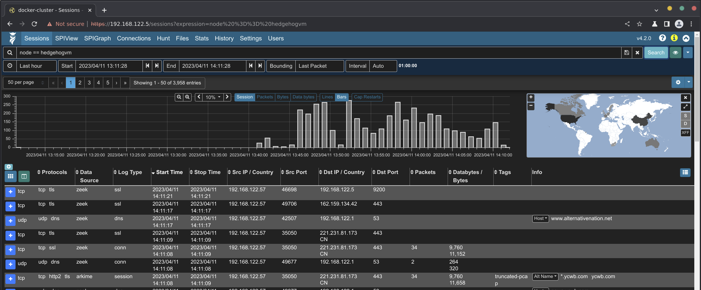

*Arkime's sessions view with a filter on `node`*

Arkime's views button (indicated by the eyeball **👁** icon) allows overlaying additional previously-specified filters onto the current sessions filters. For convenience, Malcolm provides several Arkime preconfigured views including filtering on the `event.provider` and `event.dataset` fields. This can be combined with the `node` filter described above to verify that different network log types (e.g., Arkime sessions, Zeek logs, Suricata alerts, etc.) are all being captured and forwarded correctly.

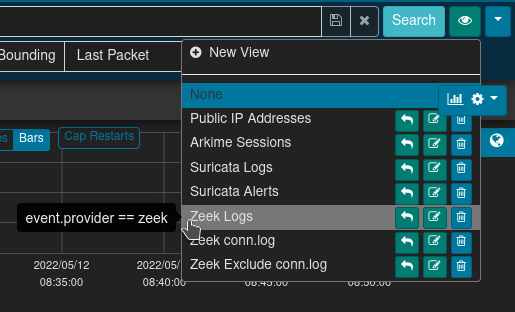
