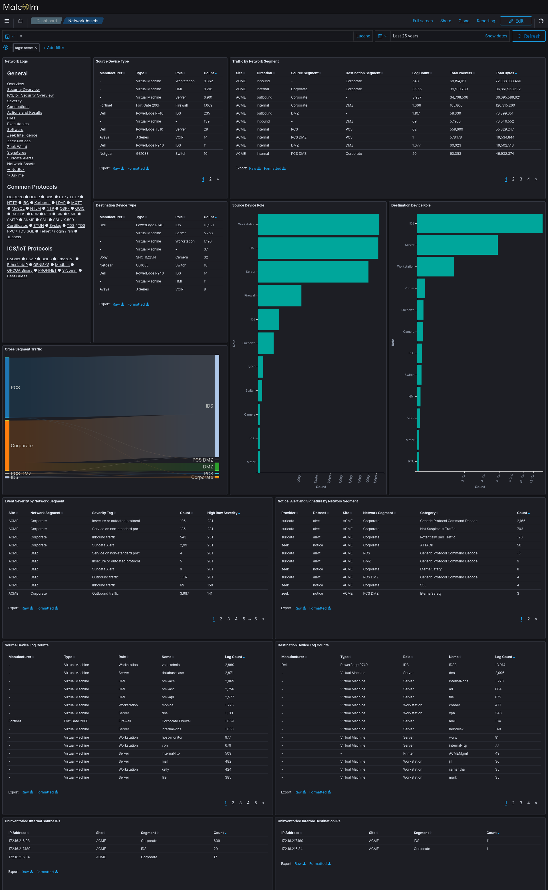

# <a name="NetBox"></a>Asset Management with NetBox

Malcolm provides an instance of [NetBox](https://netbox.dev/), an open-source "solution for modeling and documenting modern networks." The NetBox web interface is available at at [https://localhost/netbox/](https://localhost/netbox/) if you are connecting locally.

The design of a potentially deeper integration between Malcolm and Netbox is a [work in progress](https://github.com/idaholab/Malcolm/issues/131).

Please see the [NetBox page on GitHub](https://github.com/netbox-community/netbox), its [documentation](https://docs.netbox.dev/en/stable/) and its [public demo](https://demo.netbox.dev/) for more information.

## <a name="NetBoxEnrichment"></a>Enriching network traffic metadata via NetBox lookups

See [idaholab/Malcolm#132](https://github.com/idaholab/Malcolm/issues/132).

## <a name="NetBoxCompare"></a>Compare and highlight discrepancies between NetBox inventory and observed network traffic

See [idaholab/Malcolm#133](https://github.com/idaholab/Malcolm/issues/133).

## <a name="NetBoxVuln"></a>Compare NetBox inventory with database of known vulnerabilities

See [idaholab/Malcolm#134](https://github.com/idaholab/Malcolm/issues/134).

## <a name="NetBoxPopPassive"></a>Populate NetBox inventory via passively-gathered network traffic metadata

The purpose of an asset management system is to document the intended state of a network: were Malcolm to actively and agressively populate NetBox with the live network state, a network configuration fault could result in an incorrect documented configuration. The Malcolm development team is investigating what data, if any, should automatically flow to NetBox based on traffic observed (enabled via the `NETBOX_CRON` [environment variable in `docker-compose.yml`](malcolm-config.md#DockerComposeYml)), and what NetBox inventory data could be used, if any, to enrich Malcolm's network traffic metadata. Well-considered suggestions in this area are welcome.

See [idaholab/Malcolm#135](https://github.com/idaholab/Malcolm/issues/135).

## <a name="NetBoxPopActive"></a>Populate NetBox inventory via active discovery

See [idaholab/Malcolm#136](https://github.com/idaholab/Malcolm/issues/136).

## <a name="NetBoxUI"></a>NetBox User Interfaces



## <a name="NetBoxBackup"></a>Backup and Restore

The NetBox database may be backed up and restored using `./scripts/netbox-backup` and `./scripts/netbox-restore`, respectively. While Malcolm is running, run the following command from within the Malcolm installation directory to backup the entire NetBox database:

```
$ ./scripts/netbox-backup
NetBox configuration database saved to malcolm_netbox_backup_20230110-125620.psql.gz
```

To clear the existing NetBox database and restore a previous backup, run the following command (substituting the filename of the `netbox_….psql.gz` you wish to restore) from within the Malcolm installation directory while Malcolm is running:

```
./scripts/netbox-restore --netbox-restore ./malcolm_netbox_backup_20230110-125756.psql.gz

```

Note that some of the data in the NetBox database is cryptographically signed with the value of the `SECRET_KEY` environment variable in the `./netbox/env/netbox.env` environment file. A restored NetBox backup **will not work** if this value is different from when it was created.
